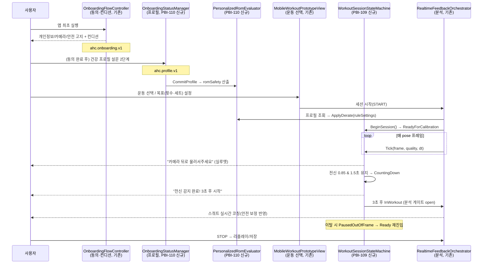
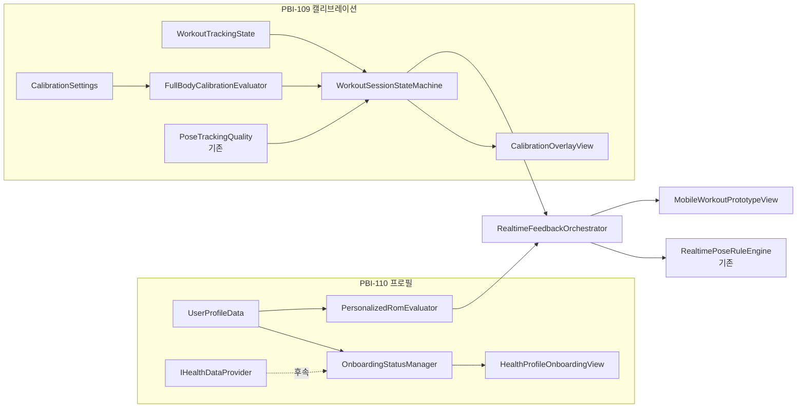

# PBI-109 & PBI-110 통합 구현 마스터 플랜

> **문서 성격**: 코드 작업 전 **승인용 마스터 플랜**입니다. 두 기능(전신 캘리브레이션, 건강 프로필 온보딩)의 관계·구현 순서·의존성·검증을 한눈에 보기 위한 인덱스 문서입니다. 승인 전에는 `.cs` 코드 파일을 수정하지 않습니다.
>
> **MVP 포지셔닝**: 피트니스 자세 코칭 보조. 의료 진단·치료·재활 처방이 아닙니다. 부상 이력은 **안전 보정(safety derate)** 코칭에만 사용합니다.

## 1. 개요 및 Linear 이슈

| PBI | Linear | 기능 | 상세 설계서 |
| --- | --- | --- | --- |
| **PBI-109** | [AI-146](https://linear.app/ai-healthcare-coach/issue/AI-146) | 운동 전 전신 측정/캘리브레이션 상태 머신 (Ready→Countdown→Workout→Paused) | [`plans/plan_full_body_calibration.md`](../plans/plan_full_body_calibration.md) |
| **PBI-110** | [AI-147](https://linear.app/ai-healthcare-coach/issue/AI-147) | 신규 사용자 건강/운동 프로필 온보딩 + 맞춤 ROM 안전 보정 | [`plans/plan_user_onboarding_health_profile.md`](../plans/plan_user_onboarding_health_profile.md) |

**두 기능의 관계**
- **PBI-110**은 "누구를 코칭하는가"(사용자 프로필·안전 보정 파라미터)를 정의하고, **PBI-109**는 "언제 코칭을 시작·중단하는가"(세션 준비 상태)를 정의합니다.
- 두 기능은 모두 `RealtimeFeedbackOrchestrator`에서 만나 실제 스쿼트 분석 파이프라인에 반영됩니다. PBI-109는 **분석 실행 게이트**(InWorkout일 때만), PBI-110은 **분석 규칙 파라미터**(ROM 안전 보정)를 담당하며 서로 직교(독립)합니다.

## 2. 통합 사용자 여정 (End-to-End)

## 3. 권장 구현 순서

### 결론: **PBI-110 데이터 계층 → PBI-109 전체 → PBI-110 UI/주입 마무리** (하이브리드, 부분 병렬)

| 순번 | 작업 | 소속 | 병렬 가능성 |
| --- | --- | --- | --- |
| 1 | PBI-110 Phase 1·2 (데이터 모델·보정 엔진, 순수 로직) | PBI-110 | PBI-109 Phase A와 **병렬 가능** (파일 겹침 없음) |
| 2 | PBI-109 Phase A·B·C (상태 머신·게이트·UI) | PBI-109 | 위와 병렬 |
| 3 | PBI-110 Phase 3 (규칙 엔진 주입) | PBI-110 | PBI-109 Phase B 완료 후 (동일 파일 `RealtimeFeedbackOrchestrator` 수정 순차화) |
| 4 | PBI-110 Phase 4 (온보딩 UI·게이트) | PBI-110 | 독립 |
| 5 | PBI-109 Phase D (캘리브 프로필, 선택) | PBI-109 | 후속 |

**이유**
- **PBI-110 데이터 계층(Phase 1·2)을 먼저**: 순수 로직이라 위험이 낮고, 사람/실기기 없이 검증 가능하며 다른 작업을 막지 않습니다.
- **PBI-109를 그다음 우선 완성**: 캘리브레이션 게이트는 세션 파이프라인의 골격을 바꾸므로(분석 실행 시점), 프로필 주입(PBI-110 Phase 3)보다 먼저 안정화하는 편이 통합 충돌을 줄입니다.
- **`RealtimeFeedbackOrchestrator` 충돌 관리**: PBI-109 Phase B와 PBI-110 Phase 3 모두 이 파일을 수정하므로 **순차 진행**(B → 3)하여 병합 충돌·회귀를 방지합니다.

## 4. 파일별 소유권 매트릭스

| 파일 | 상태 | 소유 PBI | 비고 |
| --- | --- | --- | --- |
| `Pose/Session/WorkoutTrackingState.cs` | 신규 | PBI-109 | 상태 enum |
| `Pose/Session/FullBodyCalibrationEvaluator.cs` | 신규 | PBI-109 | 0.85/1.5초 판정 |
| `Pose/Session/WorkoutSessionStateMachine.cs` | 신규 | PBI-109 | 상태 전이 |
| `Pose/Session/CalibrationSettings.cs` | 신규 | PBI-109 | 임계/타이밍 |
| `UI/Calibration/CalibrationOverlayView.cs` | 신규 | PBI-109 | 실루엣·카운트다운 |
| `Product/UserProfileData.cs` | 신규 | PBI-110 | 프로필 모델·`RomSafetyProfile` |
| `Product/OnboardingStatusManager.cs` | 신규 | PBI-110 | `ahc.profile.v1` |
| `Product/Health/IHealthDataProvider.cs` | 신규 | PBI-110 | TODO 훅 |
| `Product/Health/ManualHealthDataProvider.cs` | 신규 | PBI-110 | MVP 구현 |
| `Rag/Runtime/PersonalizedRomEvaluator.cs` | 신규 | PBI-110 | 안전 보정 산출/적용 |
| `UI/Onboarding/HealthProfileOnboardingView.cs` | 신규 | PBI-110 | 2단계 설문 |
| **`Rag/Runtime/RealtimeFeedbackOrchestrator.cs`** | **수정(공유)** | **PBI-109 + PBI-110** | **순차 수정**: 상태 게이트(109) → 보정 주입(110) |
| `UI/MobileWorkoutPrototypeView.cs` | 수정 | PBI-109(오버레이), PBI-110(게이트) | 세션 스텝 오버레이·진입 게이트 |
| `Product/OnboardingFlowController.cs` | **변경 없음** | — | 동의 온보딩, 침범 금지 |
| `Rag/Runtime/PoseTrackingQuality.cs` | **변경 없음** | — | 분석 게이트 임계 유지(재사용만) |
| `Rag/Runtime/RealtimePoseRuleSettings.cs` | **변경 없음(권장)** | — | 델타는 사본에 적용, 원본 불변 |
| `Pose/Calibration/PoseCalibrationService.cs` | 변경 없음(협력) | PBI-109 Phase D | 프로필 샘플링 훅 |

## 5. 의존성 그래프

**핵심 의존성 규칙**
- `WorkoutSessionStateMachine`는 기존 `PoseTrackingQualityReport`를 **입력으로만** 소비(수정 금지).
- `PersonalizedRomEvaluator`는 `RealtimePoseRuleSettings`를 **읽고 사본을 생성**(원본 불변).
- 두 신규 관심사는 `RealtimeFeedbackOrchestrator`라는 단일 합류점에서만 만난다.

## 6. QA 체크리스트

### 기능 (자동/에디터 검증 가능)
- [ ] PBI-110: 신규→`HasCompletedProfile=false`, 저장 후 `true`, 재로드 복원
- [ ] PBI-110: 무릎 부상 → `minimumBottomKneeAngle` 55→80(사본), 원본 불변
- [ ] PBI-110: 허리 부상 → `maximumTorsoTiltDegrees` 42→30
- [ ] PBI-110: 무릎+허리 → 안전 방향 값 채택
- [ ] PBI-109: 전신 0.85 & 1.5초 유지 → CountingDown
- [ ] PBI-109: 카운트다운 중 이탈 → Ready 롤백
- [ ] PBI-109: 카운트다운 3초 → InWorkout(게이트 open)
- [ ] PBI-109: InWorkout 이전 분석/피드백 미실행
- [ ] PBI-109: 운동 중 이탈 → PausedOutOfFrame → 분석 일시정지

### 통합
- [ ] 동의 완료 후 프로필 미완료 시 설문 표시, 완료 후 재진입 스킵
- [ ] 프로필 안전 보정이 세션 규칙 설정에 반영(무릎 부상 프로필 → 이른 깊이 경고)
- [ ] 프로필 없음 사용자 경로가 기존과 동일(회귀 없음)
- [ ] PBI-109 게이트 도입 후 기존 rep 카운트/피드백 회귀 없음

### 문구/안전 (검토)
- [ ] 모든 사용자 문구가 비의료(피트니스 코칭) 톤, 진단/치료/완치 금칙 준수
- [ ] 캘리브레이션 안내 문구 톤이 기존 `PoseTrackingQualityEvaluator` 문구와 일관

### 실기기 (외부 증거 필요)
- [ ] 전신 프레이밍·역광·하체 잘림·운동 중 이탈 (`docs/qa/device-matrix.md`)
- [ ] 설문 UI 입력성·이해도 (`docs/qa/usability-test-script.md`)
- [ ] 프로필/세션 데이터 영속성 및 전체 삭제 100%

## 7. 완료 정의 (DoD, 통합)
- [ ] 두 상세 설계서(PBI-109/PBI-110)의 작업 체크박스가 모두 `[x]` 처리
- [ ] 신규/수정 C# 파일 빌드 에러 없음, 기존 기능 회귀 없음
- [ ] `RealtimeFeedbackOrchestrator` 공유 수정이 순차(109→110) 병합되어 충돌 없음
- [ ] 자동 검증 시나리오(AT-*) 통과 및 결정론 확인
- [ ] 실기기 검증 항목은 외부 증거 확보 후 Linear 상태 갱신
- [ ] 변경 목적·구현 내용·검증 결과를 한국어 커밋 메시지로 정리해 커밋·푸시
- [ ] Linear AI-146 / AI-147 상태 동기화(In Progress → Done)

## 8. MVP 범위 요약
- **MVP**: PBI-110 Phase 1~4(수동 입력·PlayerPrefs·안전 보정·게이트), PBI-109 Phase A~C(상태 머신·게이트·기본 UI).
- **후속(MVP+)**: `IHealthDataProvider` 실제 연동(HealthKit/Google Fit/InBody), 암호화 DB, RAG 프롬프트 프로필 바인딩, PBI-109 Phase D(캘리브 프로필 확정), 다중 운동 확장.

## 9. 통합 리스크 / 미결 결정
- 공유 파일 `RealtimeFeedbackOrchestrator` 순차 수정 필요(병합 충돌 리스크) → 순서 강제.
- 안전 보정 수치(§ PBI-110 8절)는 초기 제안, 피트니스 전문가 검수(비의료) 및 튜닝 필요.
- 캘리브레이션 임계(0.85/1.5초/0.60 이탈)의 실기기 과민/둔감 튜닝 필요. iOS 전면 카메라에서는 0.85가 Good 판정을 과도하게 막을 수 있으므로 **세션 캘리브 전용 임계**와 운동 중 `PoseTrackingQuality`(0.45)를 반드시 분리한다.
- 프로필 저장 보안(평문 vs 암호화) 및 민감정보 정책은 거버넌스 문서와 정합 필요. MVP는 PlayerPrefs JSON, 후속 암호화.
- 상태 SSOT: `MobileWorkoutPrototypeView.SessionTransitionKind`(카메라/추적 코루틴)와 `WorkoutSessionStateMachine`이 이중 상태가 되지 않도록, 세션 준비 상태는 상태 머신만 소유하고 UI는 구독만 한다.
- 각 상세 설계서의 Open Questions(O-1~O-5, OQ-1~OQ-6) 확정 후 착수 권장.

## 10. 코드베이스 조사로 확인된 추가 재사용 훅

코드 조사([온보딩/캘리브레이션 코드 조사](40b19c83-6674-4b0c-8642-cd3c73c3fc0c))에서 확인된, 구현 시 바로 붙일 훅:

| 훅 | 경로 | 용도 |
| --- | --- | --- |
| `CoreEventName.OnboardingCompleted` / `CalibrationCompleted` | `Analytics/SessionAnalytics.cs` | 완료 이벤트 로깅(이미 enum 예약) |
| `SafetyPauseMonitor` | `Feedback/FeedbackAccessibilityController.cs` | ROM 안전 보정·일시정지와 충돌 없는지 연동 검토 |
| UI Toolkit 코드 생성 패턴 | `UI/MobileWorkoutPrototypeView.cs` | UXML/USS 미사용. 온보딩·캘리브 UI도 동일 런타임 생성 + NotoSansKR 폰트 패턴 유지 |
| Linear 이슈 본문 스크립트 | `tools/create_linear_*_pbi.py` | 요구사항 원문 참조용(이미 AI-146/147 생성됨) |
