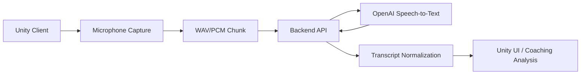

# Unity Speech-to-Text 구현 계획

작성일: 2026-06-26  
결정: OpenAI Speech-to-Text API를 사용한다.

## 1. 목표

Unity 코칭 앱에서 사용자가 말한 음성을 텍스트로 변환한다. 1차 목표는 "정확도 높은 사용자 발화 기록"이고, 이후 코칭 분석, 피드백 생성, 대화 히스토리 저장으로 확장한다.

핵심 요구사항:

- 한국어 음성 인식 정확도 우선
- 상업 서비스에 사용할 수 있는 API 구조
- Unity 클라이언트에 API 키를 노출하지 않는 구조
- 코치 음성과 사용자 음성이 섞이는 상황에 대한 대응
- MVP 이후 실시간 받아쓰기 확장 가능

## 2. 권장 구현 방향

처음부터 완전 실시간으로 가지 않고, 2단계로 구현한다.

1. MVP: 버튼을 누르고 말하기, 3-10초 단위 녹음, 서버 전송, 텍스트 반환
2. 확장: 음성 구간 자동 감지, 스트리밍 전송, 실시간 텍스트 표시

이 방식이 좋은 이유는 정확도 검증, 비용 확인, 녹음 품질 개선을 먼저 할 수 있기 때문이다. 코칭 앱에서는 실시간성보다 "잘못 인식된 문장을 줄이는 것"이 더 중요할 가능성이 높다.

## 3. 전체 구조



구성 원칙:

- Unity는 마이크 입력, 녹음 UI, 서버 통신만 담당한다.
- OpenAI API 키는 백엔드 서버의 환경변수로만 보관한다.
- 백엔드는 오디오 파일 검증, OpenAI 호출, 후처리, 저장 정책을 담당한다.
- 텍스트 분석이나 코칭 피드백은 STT 이후 별도 단계로 분리한다.

## 4. OpenAI API 선택

### MVP용 API

OpenAI `audio.transcriptions` 엔드포인트를 사용한다.

권장 모델:

- 기본: `gpt-4o-transcribe`
- 비용 최적화: `gpt-4o-mini-transcribe`
- 화자 구분 필요 시: `gpt-4o-transcribe-diarize`

권장 파라미터:

- `model`: `gpt-4o-transcribe`
- `language`: `ko`
- `prompt`: 코칭 분야 용어, 자주 쓰는 표현, 서비스 문맥
- `response_format`: `json`
- `include`: 필요 시 `logprobs`로 신뢰도 확인

공식 문서 기준으로 `gpt-4o-transcribe`와 `gpt-4o-mini-transcribe`는 프롬프트를 통해 전사 품질을 개선할 수 있다. 반면 `gpt-4o-transcribe-diarize`는 화자 라벨을 제공하지만 프롬프트는 지원하지 않는다.

참고:

- OpenAI Speech-to-Text: https://developers.openai.com/api/docs/guides/speech-to-text
- Audio transcription API reference: https://developers.openai.com/api/reference/resources/audio/subresources/transcriptions/methods/create

### 실시간 확장용 API

실시간 텍스트가 필요해지면 Realtime transcription을 사용한다.

권장 구조:


Realtime transcription은 오디오가 들어오는 동안 텍스트 delta를 받을 수 있다. Unity에서 OpenAI로 직접 연결하지 말고, 백엔드 WebSocket을 중계 서버로 둔다.

참고:

- Realtime transcription: https://developers.openai.com/api/docs/guides/realtime-transcription

## 5. Unity 구현 계획

### 5.1 마이크 입력

구현 항목:

- `Microphone.Start`로 녹음 시작
- 샘플레이트는 우선 16kHz 또는 24kHz로 통일
- 3-10초 단위로 음성 조각 생성
- WAV 변환 유틸리티 작성
- 녹음 중 UI 상태 표시

권장 UI:

- 말하기 시작 버튼
- 녹음 중 표시
- 전송 중 표시
- 변환된 텍스트 표시
- 재시도 버튼

### 5.2 녹음 방식

MVP에서는 Push-to-talk 방식을 사용한다.

이유:

- 코치 음성과 사용자 음성이 섞이는 문제를 줄일 수 있다.
- 음성 구간 감지 오류를 줄일 수 있다.
- 사용자가 의도한 발화만 전송하므로 비용 관리가 쉽다.

추후 자동 감지 방식으로 확장할 때는 VAD를 추가한다.

## 6. 백엔드 구현 계획

백엔드는 Unity와 OpenAI 사이에 반드시 둔다.

필수 API:

- `POST /api/stt/transcribe`
- 입력: `multipart/form-data` 또는 binary audio
- 출력: `{ text, confidence?, durationMs, provider, model }`

서버 처리 순서:

1. 인증된 사용자 요청인지 확인
2. 파일 크기, 확장자, 길이 제한 검증
3. 오디오 포맷을 WAV/MP3 등 OpenAI 지원 포맷으로 정리
4. OpenAI `audio.transcriptions` 호출
5. 전사 결과 후처리
6. 필요한 경우 DB 저장
7. Unity에 텍스트 반환

환경변수:

```text
OPENAI_API_KEY=...
OPENAI_STT_MODEL=gpt-4o-transcribe
STT_MAX_AUDIO_SECONDS=30
STT_STORE_AUDIO=false
STT_STORE_TRANSCRIPT=true
```

## 7. 정확도 개선 전략

정확도는 API 선택보다 녹음 품질에서 크게 갈린다.

우선순위:

1. 헤드셋 또는 핀마이크 사용
2. 코치 음성이 스피커로 새어 들어가지 않게 이어폰 사용
3. Push-to-talk로 사용자 발화만 녹음
4. `language=ko` 지정
5. `prompt`에 코칭 용어 사전 제공
6. 말이 끝난 뒤 문장 정리 후처리 추가
7. 낮은 신뢰도 구간은 사용자에게 확인 요청

프롬프트 예시:

```text
이 음성은 한국어 코칭 세션에서 사용자가 말한 내용입니다.
운동, 자세, 호흡, 목표, 피드백, 루틴, 통증, 집중도 관련 표현이 자주 등장합니다.
전문 용어와 고유명사는 가능한 한 자연스러운 한국어로 전사하세요.
```

후처리 예시:

- filler 제거: "어", "음", "그니까" 과다 제거
- 문장부호 보정
- 코칭 용어 치환
- 너무 짧거나 불확실한 결과는 저장하지 않음

## 8. 화자 분리 전략

초기 버전에서는 화자 분리보다 입력 제어를 우선한다.

권장 순서:

1. 사용자 전용 마이크 또는 헤드셋
2. Push-to-talk
3. 코치 음성은 이어폰으로 출력
4. 그래도 섞이면 `gpt-4o-transcribe-diarize` 검토

주의:

- 화자 분리는 완벽하지 않다.
- 실시간 Realtime API에서는 `gpt-4o-transcribe-diarize`가 지원되지 않는 것으로 문서화되어 있으므로, 화자 구분이 중요하면 녹음 파일 기반 처리부터 검증한다.

## 9. 상업 서비스 체크리스트

OpenAI Services Agreement 기준으로 API를 고객 앱에 통합해 최종 사용자에게 제공할 수 있다. 단, 실제 상업 서비스에서는 약관뿐 아니라 개인정보와 녹음 동의 처리가 필요하다.

필수 항목:

- 사용자에게 음성 녹음 및 STT 처리 동의 받기
- 개인정보 처리방침에 음성/전사문 처리 목적 명시
- 오디오 원본 저장 여부 명시
- 전사 텍스트 저장 기간 명시
- 사용자가 삭제 요청할 수 있는 기능 준비
- API 키는 서버 환경변수에만 보관
- 장애/오인식 시 면책 및 사용자 확인 UX 제공

OpenAI 데이터 관련 공식 문서에는 API로 보낸 데이터가 기본적으로 모델 학습에 사용되지 않으며, `/v1/audio/transcriptions`는 학습 사용 여부가 `No`로 표시되어 있다.

참고:

- Data controls: https://developers.openai.com/api/docs/guides/your-data
- OpenAI Services Agreement: https://openai.com/policies/services-agreement/

## 10. 개발 단계

### Phase 1: STT MVP

목표: Unity에서 녹음한 음성을 텍스트로 변환한다.

작업:

- Unity 마이크 녹음 기능 구현
- WAV 변환 구현
- 백엔드 `POST /api/stt/transcribe` 구현
- OpenAI `gpt-4o-transcribe` 호출
- 변환 결과를 Unity UI에 표시
- 20-30개 한국어 테스트 발화로 정확도 확인

완료 기준:

- 버튼을 누르고 말하면 3-10초 내 텍스트가 반환된다.
- API 키가 Unity 빌드에 포함되지 않는다.
- 실패 시 재시도/오류 메시지가 표시된다.

### Phase 2: 정확도 개선

목표: 코칭 상황에서 쓸 수 있는 품질로 올린다.

작업:

- 코칭 용어 프롬프트 작성
- `language=ko` 적용
- 마이크 품질별 테스트
- 배경 소음 테스트
- 코치 음성 유입 테스트
- 후처리 규칙 작성
- 낮은 신뢰도 결과 표시 방식 설계

완료 기준:

- 일반 발화 기준 사용 가능한 정확도 확보
- 코칭 핵심 단어 오인식 목록 관리
- 재녹음 또는 사용자 확인 UX 정의

### Phase 3: 저장 및 코칭 분석 연결

목표: 전사 텍스트를 코칭 시스템에서 활용한다.

작업:

- 전사 결과 DB 저장
- 세션 ID, 사용자 ID, 타임스탬프 연결
- 코칭 분석 API와 연결
- 민감정보 마스킹 또는 삭제 정책 적용

완료 기준:

- 코칭 세션별 발화 기록 조회 가능
- 저장/삭제 정책이 코드와 문서에 반영된다.

### Phase 4: 실시간 확장

목표: 말하는 중 텍스트가 표시되도록 확장한다.

작업:

- Unity에서 PCM chunk 스트리밍
- 백엔드 WebSocket 구현
- OpenAI Realtime transcription 연결
- partial/final transcript UI 분리
- 네트워크 끊김 복구
- 비용 모니터링

완료 기준:

- 말하는 중 partial text가 표시된다.
- 발화 종료 후 final text로 확정된다.
- 지연시간과 비용이 상용 기준에 맞는다.

## 11. 테스트 계획

테스트 데이터:

- 조용한 환경
- 카페 수준 배경 소음
- 코치 음성이 이어폰으로 나오는 환경
- 코치 음성이 스피커로 새는 환경
- 빠르게 말하는 사용자
- 발음이 부정확한 사용자
- 코칭 전문 용어 포함 발화

측정 항목:

- 단어 오류율
- 핵심 키워드 인식률
- 평균 응답 시간
- 실패율
- 사용자 재시도율
- 1분당 비용

최소 테스트 문장 수:

- MVP: 20-30문장
- 상용 전 검증: 200문장 이상

## 12. 리스크와 대응

| 리스크 | 대응 |
| --- | --- |
| 코치 목소리까지 같이 전사됨 | Push-to-talk, 헤드셋, 이어폰 사용 |
| 한국어 전문 용어 오인식 | prompt와 후처리 사전 사용 |
| Unity에 API 키 노출 | 백엔드 서버에서만 OpenAI 호출 |
| 실시간 처리 지연 | MVP는 파일 기반, 이후 WebSocket 확장 |
| 비용 예측 어려움 | 음성 길이 제한, 월별 사용량 모니터링 |
| 개인정보 이슈 | 녹음 동의, 저장 기간, 삭제 기능 명시 |

## 13. 우선 결론

가장 현실적인 첫 구현은 다음과 같다.

```text
Unity Push-to-talk
-> 3-10초 WAV 녹음
-> 백엔드 업로드
-> OpenAI gpt-4o-transcribe
-> 한국어 prompt 적용
-> 텍스트 후처리
-> Unity 화면 표시 및 세션 저장
```

실시간 기능은 MVP 정확도와 비용을 확인한 뒤 붙이는 것이 좋다.
