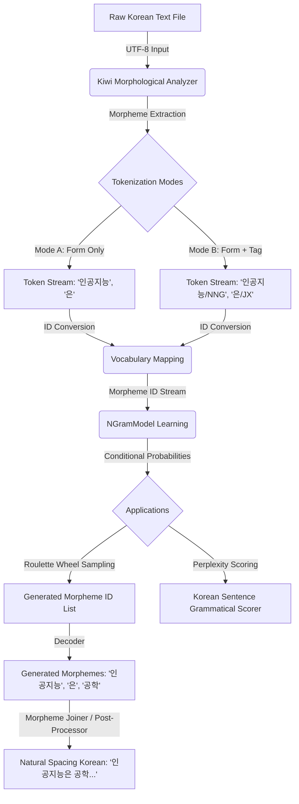

# C++ N-gram 언어 모델 개발 - 2단계: Kiwi 형태소 분석기 통합 계획서

이 계획서는 한국어의 교착어적 특성(조사와 어미가 어근에 결합하는 특성)으로 인해 발생하는 **어휘 희소성(Vocabulary Sparsity)** 문제를 해결하고, 생성되는 한글 문장의 완성도와 자연스러움을 혁신적으로 끌어올리기 위해 **[bab2min/Kiwi](https://github.com/bab2min/Kiwi)**(한국어 형태소 분석기)를 C++ 프로젝트에 통합하기 위한 상세 설계도입니다.

---

## 1. 2단계 통합의 배경 및 해결하고자 하는 과제

1단계에서 구현한 **띄어쓰기/구두점 기준 토크나이저**는 한국어 분석 및 문장 생성 시 심각한 한계를 가집니다.

*   **어휘 희소성 문제**: `"인공지능은"`, `"인공지능이"`, `"인공지능을"`, `"인공지능과"`가 모두 별개의 단어(Token)로 학습되어 데이터가 분산되고, 학습 효율이 저하됩니다.
*   **부자연스러운 띄어쓰기 생성**: N-gram 확률 모델이 단어 조각(morphemes) 단위로 생성될 경우 `"인공지능 은 우리 가 공부 하 는"`과 같이 모든 형태소 사이에 공백이 들어간 읽기 힘든 문장이 생성됩니다.
*   **다의어 모호성**: `"배가 아프다"`, `"배를 타다"`, `"배를 먹다"`에서 `"배"`의 의미(신체, 교통수단, 과일)와 품사를 구별하지 못해 문맥 연결이 부자연스럽습니다.

### 🌟 Kiwi 도입 후 기대 성능 및 자연스러움 비교 분석

| 성능/기능 지표 | 1단계: 띄어쓰기 기반 (As-Is) | 2단계: Kiwi 형태소 분석기 통합 (To-Be) | 개선으로 얻는 효과 및 자연스러움 |
| :--- | :--- | :--- | :--- |
| **토큰 분리 기준** | 단순 공백 및 구두점 분리 | **형태소(어근, 조사, 어미) 단위** 분리 | 문장의 문법적 뼈대와 문맥을 정확하게 학습합니다. |
| **어휘 수(Vocab Size)** | **불필요하게 매우 큼** (조사 결합 형태 포함) | **최적화됨** (조사/어미 분리로 핵심 어휘 압축) | 중복된 어휘 표기를 줄여 적은 데이터로도 높은 예측 성능을 냅니다. |
| **품사(POS) 태깅 정보** | 없음 (문맥적 모호성 발생) | **세종 품사 태그 탑재 (NNG, JXO, VV 등)** | 다의어의 어법을 명확히 분류하고 어법에 맞는 다음 단어를 예측합니다. |
| **생성 문장 띄어쓰기** | 단순 공백 연결 (`인공지능 은 공부 하 는...`) | **Morpheme Joiner 규칙 결합** (`인공지능은 공부하는...`) | **사람이 직접 쓴 것과 같은 완벽한 띄어쓰기 문장**을 자동 완성합니다. |

---

## 2. 시스템 아키텍처 및 데이터 흐름 (Phase 2)

형태소 단위 토큰화와 문장 생성 후 다시 자연스러운 완성형 한글 문장으로 복원하는 역방향 데이터 흐름을 추가합니다.

### 🔄 전체 시스템 데이터 흐름도 (Data Flow)



---

## 3. 세부 제안 및 구현 사항

### 🛠️ [MODIFY] [CMakeLists.txt](file:///d:/Ai/ngram_project/CMakeLists.txt)
Kiwi C++ 라이브러리를 프로젝트에 연동하고 빌드합니다. `FetchContent` 모듈을 활용하여 빌드 시점에 자동으로 C++ 소스를 가져오거나, 로컬 서브디렉토리로 기획합니다.

```cmake
include(FetchContent)
FetchContent_Declare(
    kiwi_analyzer
    GIT_REPOSITORY https://github.com/bab2min/Kiwi.git
    GIT_TAG v0.23.1
)
FetchContent_MakeAvailable(kiwi_analyzer)

# C++20 빌드 타겟에 kiwi 헤더와 라이브러리 링크
target_link_libraries(ngram_project PRIVATE kiwi)
```

### 🛠️ [MODIFY] [tokenizer.hpp](file:///d:/Ai/ngram_project/tokenizer.hpp) / [tokenizer.cpp](file:///d:/Ai/ngram_project/tokenizer.cpp)
기존의 단순 문자 스캐닝 로직을 들어내고, `kiwi::Kiwi` 엔진을 탑재하도록 재설계합니다.

*   `kiwi::Kiwi` 인스턴스를 내부 멤버 변수로 탑재합니다.
*   **토큰화 모드 지원**:
    1.  **Form-Only 모드**: 형태소의 표기만 토큰으로 사용 (`"인공지능"`, `"은"`, `"공부"`, `"하"`, `"다"`)
    2.  **Form+Tag 모드**: 형태소 표기와 세종 품사 태그를 결합하여 완벽한 문법적 맥락 확보 (`"인공지능/NNG"`, `"은/JX"`, `"공부/NNG"`, `"하/XSV"`, `"다/EF"`)

### 🛠️ [NEW] [morpheme_joiner.hpp](file:///d:/Ai/ngram_project/morpheme_joiner.hpp) / [morpheme_joiner.cpp](file:///d:/Ai/ngram_project/morpheme_joiner.cpp)
형태소 단위로 조각나 생성된 예측 시퀀스(`"인공지능"`, `"은"`, `"인간"`, `"의"`, `"미래"`, `"이"`, `"다"`)를 올바른 한국어 맞춤법과 띄어쓰기로 자동 조립해 주는 **포스트 프로세서**를 설계합니다.

*   **조사 결합 규칙**: 조사(`JKS`, `JKC`, `JKG`, `JKO`, `JKB`, `JX`, `JC` 등)가 등장하면 이전 형태소와 공백 없이 결합합니다.
*   **어미 결합 규칙**: 어미(`EP`, `EF`, `EC`, `ETN`, `ETM`) 및 접사(`XSN`, `XSV`, `XSA`)가 등장하면 앞의 용언(동사/형용사) 어근과 공백 없이 결합합니다.
*   **의존명사 및 자립어**: 명사(`NNG`, `NNP`), 대명사(`NP`), 부사(`MAG`) 등 자립 형태소 사이에는 자연스럽게 띄어쓰기(`" "`)를 삽입합니다.

### 🛠️ [MODIFY] [main.cpp](file:///d:/Ai/ngram_project/main.cpp)
사용자가 Kiwi 기반 토큰화 설정 및 한국어 결합 기능을 체감할 수 있도록 대화형 CLI 메뉴를 고도화합니다.
*   Kiwi 모델 파일 로딩 상태 표시 및 에러 핸들링.
*   문장 생성 메뉴에서 생성된 형태소 리스트와 최종 조립된 한글 문장을 비교해서 보여주어 자연스러움의 차이를 극적으로 비교 및 검증합니다.

---

## 4. 개방형 질문 및 고려 사항

> [!IMPORTANT]
> **1. 사전 모델 및 딕셔너리 리소스 관리**
> Kiwi 라이브러리는 분석을 실행하기 위해 별도의 바이너리 사전 파일(예: `default.dict` 및 하위 모델 파일들)이 필요합니다.
> - **방안 A**: `D:\Ai\docs\kiwi_models\` 디렉토리에 사전 파일을 수동 또는 자동 다운로드하여 고정 경로로 불러오도록 구성.
> - **방안 B**: 빌드 시 CMake 스크립트나 프로그램 최초 구동 시 필요한 모델 데이터를 지정 다운로드 받도록 자동화.
> *사용자의 개발 환경 편의성에 맞추어 설정을 논의하고자 합니다.*

> [!NOTE]
> **2. N-gram 학습 모드 결정**
> - **형태소 표기만 사용(Form Only)**: 구현이 직관적이며 어휘가 유연하게 매칭되나 동음이의어(예: 배-타다 vs 배-먹다) 구분이 어려움.
> - **형태소+태그 사용(Form + POS Tag)**: 약간의 텍스트 오버헤드가 있으나 문법적 정확도가 극도로 높아지고 훨씬 정교한 한글 문장 생성이 가능.
> *프로젝트의 AI 학습 정밀도를 위해 **Form+Tag 방식**을 기본값으로 추천드립니다.*

---

## 5. 단계별 검증 및 테스트 계획

### 🧪 1 단계: 형태소 토크나이저 독립 검증
- **입력 문장**: `"검색 증강 생성 기술은 현대적인 RAG 시스템입니다."`
- **기대 토큰 결과**: `["검색/NNG", "증강/NNG", "생성/NNG", "기술/NNG", "은/JX", "현대/NNG", "적/XSN", "이/VCP", "ㄴ/ETM", "RAG/SL", "시스템/NNG", "이/VCP", "ㅂ니다/EF", "./SF"]`
- **검증**: 다바이트 한글 UTF-8 인코딩이 깨지지 않고 형태소별로 완벽히 분리되는지 체크.

### 🧪 2 단계: 역방향 형태소 조립기(Morpheme Joiner) 정합성 테스트
- **입력 토큰 리스트**: `["나는", "인공지능", "을", "공부", "하", "ㄴ다", "."]`
- **결과 문장**: `"나는 인공지능을 공부한다."` (중간 공백 제거 및 적합한 결합 검증)
- **검증**: 조사와 어미가 자연스럽게 앞 단어에 찰떡같이 밀착하여 띄어쓰기가 복원되는지 확인.

### 🧪 3 단계: 최종 시나리오 비교 테스트
- 1단계 띄어쓰기 방식의 생성 결과와 2단계 Kiwi 결합 방식의 생성 문장 완성도 및 자연스러움을 직접 1대1 비교 검증.

---

## 💬 사용자 피드백 요청

이 상세 설계 및 단계별 계획에 따른 C++ 소스 코드 수정 및 CMake 라이브러리 연동 작업을 전개할 준비가 완료되었습니다.

계획을 검토해 보시고 진행을 원하신다면 **"작업 시작해줘"** 혹은 **"승인"**과 같이 편하게 의견을 전달해 주세요! 바로 1단계 통합 작업으로 넘어가겠습니다.
