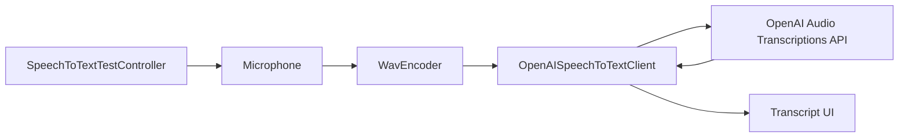
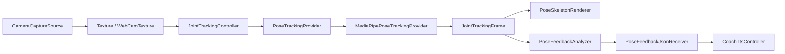

# Healthcare Coach Module Architecture

이 문서는 현재 Unity 프로젝트의 런타임 모듈 구조를 설명합니다. `SpeechTextplan.md`의 STT 계획과 `TestMediaPipeplan.md`의 로컬 관절 추적 전환 계획을 기준으로 갱신했습니다.

## Goals

- Unity 클라이언트는 입력 수집, 로컬 추론 조율, UI 표시, 피드백 전달을 담당합니다.
- 외부 STT API 호출 코드는 `Rag.Healthcare.Api` 네임스페이스로 분리합니다.
- 카메라 입력 코드는 `Rag.Healthcare.Camera` 네임스페이스로 분리합니다.
- 관절 추적은 provider 구조로 분리해 MediaPipe, Sentis, 원격 API를 교체 가능하게 둡니다.
- 자세 분석과 TTS 출력은 추적 엔진과 분리합니다.

## Module Boundaries

| Module | Path | Responsibility |
| --- | --- | --- |
| API | `Assets/Scripts/Api` | OpenAI STT, 원격 관절 추적 비교용 HTTP 클라이언트 |
| Camera | `Assets/Scripts/Camera` | 웹캠 실행, 중지, 원본 texture 접근, 선택적 JPEG 캡처 |
| Pose | `Assets/Scripts/Pose` | 관절 데이터 모델, controller, provider 선택, 피드백 전달 |
| Pose Providers | `Assets/Scripts/Pose/Providers` | `LocalMediaPipe`, `RemoteApi`, `Disabled` 등 추적 backend 구현 |
| Pose Analysis | `Assets/Scripts/Pose/Analysis` | 각도/정렬 계산, 스쿼트 피드백 규칙 |
| Pose Rendering | `Assets/Scripts/Pose/Rendering` | UI overlay skeleton 렌더링 |
| Speech | `Assets/Scripts/Speech` | 마이크 녹음, WAV 변환, STT 테스트 UI |
| TTS | `Assets/Scripts/Tts` | 코칭 피드백 음성 출력 |

## Runtime Flow

### Speech-to-Text



현재 STT 테스트 컨트롤러는 로컬 검증을 위해 API 키 입력 필드를 제공합니다. 운영 환경에서는 Unity 빌드에 OpenAI API 키를 포함하지 않고, 백엔드 API를 통해 중계해야 합니다.

### Local Pose Tracking



`JointTrackingController`는 더 이상 `PoseTrackingApiClient`를 직접 호출하지 않습니다. 대신 `PoseTrackingProvider`를 통해 추적 backend를 호출합니다.

## Pose Tracking Backends

| Backend | Class | Status |
| --- | --- | --- |
| `LocalMediaPipe` | `MediaPipePoseTrackingProvider` | 기본 목표 backend. MediaPipe 플러그인과 모델 연결 필요 |
| `RemoteApi` | `RemoteApiPoseTrackingProvider` | 기존 서버 API 비교 테스트용 |
| `LocalSentisMoveNet` | `SentisMoveNetPoseTrackingProvider` | 후속 구현 후보 |
| `Disabled` | `NullPoseTrackingProvider` | 추적 비활성화 |

`MediaPipePoseTrackingProvider`는 MediaPipe Unity 플러그인이 없는 상태에서도 프로젝트가 컴파일되도록 fallback 경로를 유지합니다. `AHC_USE_HOMULER_MEDIAPIPE` scripting define이 켜지면 Homuler MediaPipe Unity Plugin의 `PoseLandmarker`를 사용해 texture 입력을 video mode로 추론하고, 33개 landmark를 `JointTrackingFrame`으로 변환합니다.

## JointTrackingFrame Contract

모든 provider는 다음 모델로 결과를 반환해야 합니다.

```json
{
  "id": "frame_001",
  "sessionId": "session_123",
  "timestampUnixMilliseconds": 1782748800000,
  "joints": [
    {
      "name": "left_knee",
      "x": 0.42,
      "y": 0.68,
      "z": 0.01,
      "visibility": 0.94,
      "confidence": 0.91
    }
  ],
  "feedback": [
    {
      "id": "squat_knee_alignment",
      "text": "Keep your knee aligned with your foot.",
      "joint": "left_knee",
      "confidence": 0.91,
      "severity": "Warning"
    }
  ]
}
```

좌표는 0부터 1 사이의 normalized image coordinates를 우선 사용합니다. MediaPipe world coordinates가 필요해지면 `TrackedJoint`에 별도 필드를 추가하고 provider 변환 코드를 갱신합니다.

## Scene Setup

1. 씬에 `CameraCaptureSource`를 추가합니다.
2. 같은 GameObject 또는 별도 runtime GameObject에 `JointTrackingController`를 추가합니다.
3. `JointTrackingController.backend`를 `LocalMediaPipe`로 둡니다.
4. Unity Package Manager가 `com.github.homuler.mediapipe`를 resolve한 뒤 Player Settings의 scripting define에 `AHC_USE_HOMULER_MEDIAPIPE`를 추가합니다.
5. 자세 피드백을 쓰려면 `PoseFeedbackAnalyzer`, `PoseFeedbackJsonReceiver`, `CoachTtsController`를 배치합니다.
6. 관절을 화면에 보려면 preview RawImage 위 overlay RectTransform에 `PoseSkeletonRenderer`를 추가합니다.
7. preview texture와 overlay 크기를 자동 동기화하려면 `PosePreviewOverlayBinder`에 `CameraCaptureSource`, preview `RawImage`, overlay `RectTransform`을 연결합니다.
8. FPS/drop/inference 상태를 보려면 UI Text에 `PoseTrackingStatusView`를 추가합니다.
9. 원격 API 비교가 필요할 때만 `backend`를 `RemoteApi`로 바꾸고 `RemoteApiPoseTrackingProvider` endpoint를 설정합니다.

## Error Handling

- 카메라 장치가 없으면 `CameraCaptureSource.StartCamera()`는 `false`를 반환합니다.
- provider가 없으면 `JointTrackingController`가 backend에 맞는 provider를 런타임에 추가합니다.
- MediaPipe 모델이 없으면 `MediaPipe model asset is missing.` 메시지가 출력됩니다.
- MediaPipe define이 꺼져 있으면 `Install/resolve com.github.homuler.mediapipe and add scripting define 'AHC_USE_HOMULER_MEDIAPIPE'.` 안내가 출력됩니다.
- 추적 결과가 없으면 `Pose landmarks were not detected.` 메시지가 출력됩니다.
- 원격 API 오류는 `RemoteApiPoseTrackingProvider`에서 처리합니다.

## Next Tasks

- MediaPipe Unity 플러그인 resolve 후 샘플 scene을 먼저 검증합니다.
- 기본 모델은 `Assets/StreamingAssets/MediaPipe/pose_landmarker_lite.task`에 배치되어 있습니다.
- `MediaPipePoseTrackingProvider`는 texture 입력 변환, video timestamp 전달, 33개 landmark 매핑을 수행합니다.
- `PosePreviewOverlayBinder`와 `PoseSkeletonRenderer`를 실제 카메라 preview overlay에 연결해 좌표 반전과 크기를 검증합니다.
- `PoseFeedbackAnalyzer`의 기준값을 운동별 ScriptableObject로 분리합니다.
