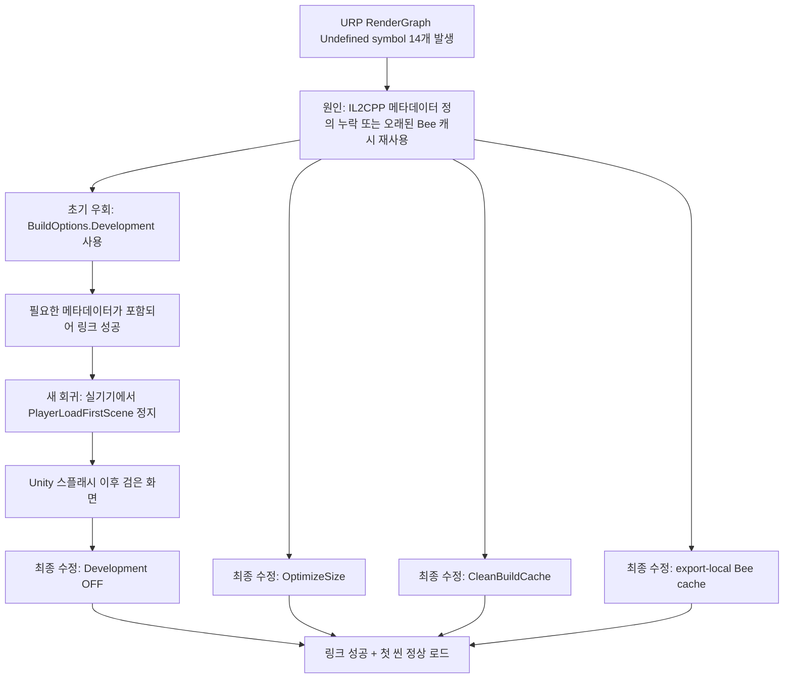
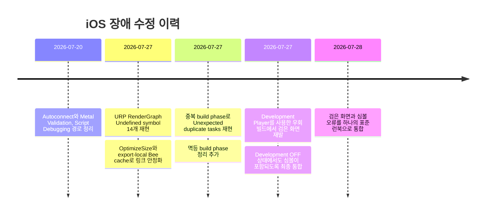

# iOS 검은 화면과 Xcode 심볼 오류 통합 트러블슈팅

작성일: 2026-07-28
대상 프로젝트: AI Healthcare Coach
재현·검증 환경 기록: Unity `6000.3.18f1`, Xcode `16.2`,
iPhone XS Max / iOS `18.7.9`

## 1. 문서 목적

이 문서는 프로젝트에서 반복해서 발생했던 다음 두 문제를 하나의 흐름으로
정리한 장애 대응 문서다.

1. Unity 스플래시 이후 화면이 검은색으로 남고 첫 화면으로 넘어가지 않는 문제
2. Xcode에서 `UnityFramework`를 링크할 때 URP RenderGraph 관련
   `Undefined symbol` 14개가 발생하는 문제

두 문제는 별개의 증상이지만 수정 과정에서는 서로 연결되어 있었다.
심볼 누락을 피하려고 Unity Development Player를 켰을 때 심볼은 포함됐지만,
실기기에서는 첫 씬 로드가 멈춰 검은 화면이 재발했다. 현재의 최종 해결 방식은
Development Player에 의존하지 않고 IL2CPP 코드 생성과 캐시를 안정화하는 것이다.

## 2. 최종 결론

현재 Unity `6000.3.18f1` iOS 빌드의 안정 설정은 다음과 같다.

| 항목 | 최종 설정 | 이유 |
| --- | --- | --- |
| Unity Development Player | OFF | 실기기에서 첫 씬 로드 전 정지 재현 |
| Autoconnect Profiler | OFF | PlayerConnection 대기와 시작 지연 방지 |
| Script Debugging | OFF | 관리 디버거 연결 경로 제거 |
| Wait for Managed Debugger | OFF | 시작 시 디버거 대기 방지 |
| Deep Profiling | OFF | 시작 부하와 연결 경로 제거 |
| Metal API Validation | OFF | Development/Metal 초기화 경로의 불안정 제거 |
| IL2CPP Code Generation | `OptimizeSize` | 누락됐던 generic 메타데이터 정의 생성 |
| Clean Build Cache | ON | 이전 IL2CPP 변환물 혼용 방지 |
| Bee cache | export 내부 경로 | 다른 export의 오래된 오브젝트 재사용 방지 |
| Xcode 실행 구성 | `Debug` 사용 가능 | Unity Development Player와 별개인 네이티브 디버그 구성 |
| Xcode 진입점 | `.xcworkspace` | CocoaPods와 MediaPipe 링크 설정 포함 |

핵심은 다음 한 줄이다.

> Unity Player는 비개발 빌드로 유지하고, Xcode만 Debug 구성으로 실행하며,
> IL2CPP는 `OptimizeSize + CleanBuildCache + export-local Bee cache`로 생성한다.

## 3. 두 문제의 연결 관계



---

# Part A. Unity 스플래시 이후 검은 화면

## 4. 증상

대표적인 증상은 다음과 같았다.

- Unity Editor Play Mode에서는 UI와 운동 로직이 정상이다.
- iPhone에 설치하면 Unity 스플래시 이후 화면이 검은색으로 남는다.
- 앱 프로세스의 CPU와 메모리 사용은 계속 보인다.
- 즉시 크래시하지 않아 UI Toolkit 또는 카메라 문제처럼 보인다.
- 기기 로그에는 Unity/Metal 초기화 기록이 있지만 첫 씬 완료 로그가 없다.

이 상태는 “앱 프로세스가 죽었다”와 다르다. Unity Player가 살아 있지만
첫 씬 로드 또는 렌더/UI 표시 단계까지 진행하지 못한 상태일 수 있다.

## 5. 이번 장애에서 확인된 직접 원인

### 5.1 Unity Development Player의 첫 씬 로드 정지

직접 재현된 원인은 Unity `6000.3.18f1`의 iOS Development Player였다.

실기기 프로파일링에서는 메인 스레드가 다음 경로에서 대기했다.

```text
PlayerLoadFirstScene
└─ PreloadManager::WaitForAllAsyncOperationsToComplete
```

Development Player 빌드의 기기 로그는 대략 다음 지점에서 더 진행하지 않았다.

```text
Build type 'Development'
[IOSBoot] Splash already finished
```

반대로 동일한 씬, 동일한 IL2CPP `OptimizeSize` 조건에서 Unity Development
Player만 끈 빌드는 다음 단계까지 정상적으로 진행했다.

```text
Build type 'Release'
[IOSBoot] BeforeSceneLoad
[MobileWorkoutPrototypeView] UI Toolkit workout interface built successfully.
[IOSBoot] AfterSceneLoad scene='Main'
```

여기서 `Build type 'Release'`는 Xcode의 Scheme이 반드시 Release라는 뜻이
아니다. Xcode LaunchAction을 `Debug`로 실행해도 Unity Player 자체는
비개발 Player일 수 있다.

### 5.2 UI Toolkit이 원인이 아니었던 근거

검은 화면이 UI Toolkit 변경 직후 보였기 때문에 UI Toolkit을 의심했지만,
다음 대조 결과로 직접 원인에서 제외했다.

- UI Toolkit과 운동 런타임이 없는 `SampleScene`도 Development Player에서
  같은 첫 씬 로드 지점에 멈췄다.
- Unity Development Player만 끈 빌드에서는 실제 `Main` 씬의 UI Toolkit
  생성 성공 로그가 출력됐다.
- 같은 UI 자산과 코드를 사용해도 비개발 Player에서는 화면이 표시됐다.

따라서 이 장애에서는 UI Toolkit 파일을 되돌리는 것이 해결책이 아니었다.
UI Toolkit 예외는 별도의 화면 미표시 원인이 될 수 있으므로, 첫 씬이 실제로
로드된 이후에만 조사한다.

## 6. 검은 화면을 악화시키거나 비슷하게 보이게 하는 설정

### 6.1 Autoconnect Profiler

Autoconnect가 켜지면 iPhone Player가 Unity Editor의 PlayerConnection을
찾으며 대기할 수 있다.

의심 로그:

```text
[Flags] 19
Remaining time: ...
Direct connection timeout
```

현재 대응:

- `BuildOptions.ConnectWithProfiler` 제거
- `EditorUserBuildSettings.connectProfiler = false`

### 6.2 Script Debugging과 debugger wait

`AllowDebugging`, `WaitForPlayerConnection`,
`waitForManagedDebugger`가 켜져 있으면 앱 시작 시 관리 디버거 연결 경로가
추가된다.

현재 대응:

- `BuildOptions.AllowDebugging` 제거
- `BuildOptions.WaitForPlayerConnection` 제거
- `EditorUserBuildSettings.allowDebugging = false`
- `EditorUserBuildSettings.waitForManagedDebugger = false`

### 6.3 Metal API Validation

Development/Metal 검증 경로는 실기기 렌더 시작을 불안정하게 만들 수 있다.

현재 설정:

```yaml
metalAPIValidation: 0
```

파일:

```text
ProjectSettings/ProjectSettings.asset
```

### 6.4 정상인데 검은 화면처럼 보이는 경우

현재 UI의 기본 배경은 어두우며 카메라/추적 자동 시작이 꺼져 있을 수 있다.
다음 두 상태를 구분해야 한다.

| 상태 | 구분 방법 |
| --- | --- |
| 첫 씬 로드 정지 | `BeforeSceneLoad`/`AfterSceneLoad` 또는 UI 생성 로그가 없음 |
| 정상 기동 후 어두운 초기 화면 | UI 헤더·버튼은 보이고 입력에 반응함 |

카메라 프리뷰가 없다는 사실만으로 Unity Player 정지라고 판단하지 않는다.

## 7. 검은 화면 최종 수정 내용

### 7.1 안전한 BuildOptions 강제

`Assets/Editor/IOSDevelopmentBuild.cs`의
`UseStableIOSBuildOptions()`는 Unity `6000.3.18f1`에서 다음 옵션을 제거한다.

```text
BuildOptions.Development
BuildOptions.ConnectWithProfiler
BuildOptions.AllowDebugging
BuildOptions.EnableDeepProfilingSupport
BuildOptions.WaitForPlayerConnection
```

그리고 다음 옵션을 추가한다.

```text
BuildOptions.CleanBuildCache
```

### 7.2 일반 Build / Build And Run도 보호

`Assets/Editor/IOSStableBuildSettings.cs`는 다음 경로를 모두 보호한다.

- 에디터가 열릴 때 안전한 로컬 빌드 설정 적용
- `Apply Safe iOS Build Settings` 메뉴 실행
- Unity의 일반 Build
- Unity의 Build And Run

따라서 커스텀 메뉴가 아닌 일반 빌드에서도 Development, Autoconnect,
Script Debugging이 다시 켜지지 않도록 한다.

### 7.3 Xcode Debug와 Unity Development를 분리

현재 `iOS Development Build` 메뉴 이름은 호환성을 위해 유지하지만,
실제 Unity Development Player는 사용하지 않는다.

- Unity Player: 비개발
- Xcode LaunchAction: `Debug`
- 목적: 네이티브 로그와 LLDB 사용성은 유지하면서 Unity 첫 씬 정지 경로는 피함

## 8. 검은 화면 재발 시 진단 순서

### 8.1 1단계: 설치한 앱이 정말 새 빌드인지 확인

오래된 Xcode export를 다시 실행하면 수정 전 설정이 그대로 재설치될 수 있다.
새로운 Unity export를 만들고, Xcode의 실행 대상과 Bundle ID를 확인한다.

### 8.2 2단계: `boot.config` 확인

```bash
rg -n \
  'player-connection|wait-for-.*debugger|debugger' \
  Build/iOS/Data/boot.config
```

정상 기준:

- `wait-for-native-debugger=0`
- PlayerConnection 자동 연결 또는 managed debugger 대기 항목이 없거나 비활성

### 8.3 3단계: 기기 로그의 마지막 breadcrumb 확인

| 마지막 로그 | 판단 |
| --- | --- |
| Unity 시작 로그도 없음 | 설치, 서명, 즉시 크래시 확인 |
| `[Flags] 19`, 연결 대기 | Autoconnect가 다시 켜진 빌드 |
| `Build type 'Development'` | 잘못된 Development Player 빌드 |
| `Splash already finished` 이후 정지 | 첫 씬 로드 정지 가능성 |
| `BeforeSceneLoad`까지만 있음 | 씬 초기화 중 예외/대기 조사 |
| UI Toolkit 생성 성공 후 `AfterSceneLoad` 있음 | Player 기동 정상, UI 표시·카메라 상태 별도 조사 |

### 8.4 4단계: UI Toolkit 조사는 씬 로드 이후에 수행

`AfterSceneLoad`까지 확인된 경우에만 다음을 본다.

- `MobileWorkoutPrototypeView` 생성 성공/실패 로그
- PanelSettings와 ThemeStyleSheet 로드 여부
- 첫 프레임에서 발생한 C# 예외
- UI 루트 크기와 display 상태
- 카메라 자동 시작 여부

---

# Part B. Xcode `UnityFramework` Undefined symbol

## 9. 실제 오류

Xcode의 `UnityFramework` 링크 단계에서 다음 14개 심볼이 누락됐다.

### 9.1 메서드 메타데이터 심볼 4개

```text
_NativeListExtensions_LastIndex_TisSubPassDescriptor_t912FE0FF4C99BF293A1E4442353C35B2BB8997A9_mB0063B1B438010BCCC0B16149755FECABB57D889_RuntimeMethod_var

_NativePassData_TryMerge_mD05A10EC29757BECA616AE0A22C4C3BAE534FB8B_RuntimeMethod_var

_ResourceVersionedData_RegisterReadingPass_m13D1DBD0C7AD5CC3E7B306180F07C6968D237D2E_RuntimeMethod_var

_ResourceVersionedData_SetWritingPass_m4E32086D14205081872794D1865581B24DFABF11_RuntimeMethod_var
```

### 9.2 IL2CPP 문자열 리터럴 심볼 10개

```text
__stringLiteral08C63F844E540E3E87F57D613CBDB9B37234F7FF
__stringLiteral17499968564589234BAC86E192DE5290755AC77E
__stringLiteral2538BA9991C59277BCB24CAC7FC6B6C5DA5861B2
__stringLiteral61DAACA0737E637A110357D7F6A2978EE5E1B948
__stringLiteral8359953142AE83C5AB3B63E90EA90B12CB777A8F
__stringLiteralB596487B8ED5A9B3CEE2EEB2FA6E59CE669292C4
__stringLiteralC33ADA438244B199FA9CCAB2AE8FA3D46F98294C
__stringLiteralC7E1ECAF7D5318296E8B04E88341C3ED3732D390
__stringLiteralCC255E94D829D30CFDF3B03FC07318125EE43772
__stringLiteralE970869AD43D6815A1C3F6724903C7060FCDB8A4
```

이 심볼들은 앱에서 직접 작성한 C 함수가 아니다. Unity가 URP/RenderGraph의
관리 코드를 IL2CPP로 변환하면서 생성하는 런타임 메서드 메타데이터와 문자열
상수다.

## 10. 오류의 의미

링커 관점에서 상황은 다음과 같다.

```text
생성된 IL2CPP C/C++ 오브젝트
  └─ 14개 심볼을 참조함(U: undefined reference)

libGameAssembly.a
  └─ 해당 심볼 정의가 포함되어야 함

실패 빌드
  └─ 참조는 있지만 정의가 없음

결과
  └─ UnityFramework 링크 실패
```

즉, C# 컴파일이 성공했다는 사실만으로 해결되지 않는다. 오류는 C# 이후의
IL2CPP 코드 생성, 네이티브 오브젝트 캐시, 정적 라이브러리 링크 단계에서
발생한다.

## 11. 확인된 원인

### 11.1 `OptimizeSpeed`의 분할 generic 코드 경로

실패한 export는 `OptimizeSpeed` 형태의 분할 generic translation unit을
사용했다. 생성 C++에는 RenderGraph 심볼 참조가 남아 있었지만,
`Il2CppMetadataUsage.c` 또는 최종 `libGameAssembly.a`에는 필요한 정의가
포함되지 않았다.

`OptimizeSize`로 다시 생성했을 때는 범용 generic 구현 경로를 사용했고,
누락됐던 메서드 메타데이터와 문자열 정의가 아카이브에 포함됐다.

프로젝트에서 기록한 비교:

| 코드 생성 | generic translation unit 수 | 결과 |
| --- | ---: | --- |
| 실패한 `OptimizeSpeed` export | 133개 | 14개 심볼 누락 |
| 성공한 `OptimizeSize` export | 9개 | 14개 심볼 정의 포함 |

숫자는 당시 Unity `6000.3.18f1` export의 비교 기록이며 다른 Unity 버전의
일반 규칙으로 해석하지 않는다.

### 11.2 Unity 공용 Bee 캐시 재사용

한 번 성공한 뒤 Xcode GUI에서 다시 실패한 경우도 있었다.

실패 빌드의 IL2CPP Run Script는 다음과 같은 Unity 공용 캐시를 사용했다.

```text
$HOME/Library/Unity/cache/bee
```

이 경로는 여러 export와 빌드 구성이 공유할 수 있다. 이전 코드 생성 방식의
오브젝트가 재사용되면 현재 소스와 `libGameAssembly.a`의 메타데이터 정의가
일치하지 않을 수 있다.

현재는 생성된 Xcode 프로젝트를 다음 경로로 바꾼다.

```text
$PROJECT_DIR/Il2CppBuildCache/$CONFIGURATION
```

이렇게 하면 Debug, ReleaseForRunning 등의 캐시가 export 내부에서 분리된다.

### 11.3 기존 export와 Append 빌드 혼용

Unity 코드와 설정을 수정해도 이미 생성된 Xcode 프로젝트에는 자동 반영되지
않는다. 이전 export를 Append하거나 Xcode에서 그대로 재빌드하면 다음 상태가
남을 수 있다.

- `OptimizeSpeed`로 생성된 IL2CPP 소스
- 공용 Bee 캐시 경로
- 중복 build phase 참조
- Development Player 플래그

링커 문제가 반복될 때는 기존 Xcode 폴더를 기준으로 부분 수정하지 말고,
새로운 clean export가 우선이다.

## 12. 심볼 오류 최종 수정 내용

### 12.1 모든 iOS export에서 `OptimizeSize`

`Assets/Editor/IOSDevelopmentBuild.cs`의
`IOSIl2CppBuildPreprocessor`가 모든 iOS 빌드 전에 다음을 강제한다.

```csharp
PlayerSettings.SetIl2CppCodeGeneration(
    NamedBuildTarget.iOS,
    Il2CppCodeGeneration.OptimizeSize);
```

대상:

- 커스텀 iOS Development Build 메뉴
- 커스텀 iOS Release Build 메뉴
- Unity 일반 Build
- Unity Build And Run
- 새로 생성하는 iOS export

### 12.2 `CleanBuildCache`

Unity `6000.3.18f1`에서는 빌드 옵션에 `CleanBuildCache`를 추가해
IL2CPP 변환부터 깨끗하게 다시 수행한다.

### 12.3 export-local Bee cache

생성된 `project.pbxproj`의 IL2CPP Run Script를 다음과 같이 보정한다.

```text
BEE_CACHE_DIRECTORY="$PROJECT_DIR/Il2CppBuildCache/$CONFIGURATION"
```

적용 함수:

```text
IOSDevelopmentBuild.UseProjectLocalBeeCache()
IOSDevelopmentBuild.SanitizeGeneratedXcodeProject()
```

### 12.4 중복 build phase 정리

같은 build phase UUID가 한 타깃의 `buildPhases` 목록에 두 번 들어가면 Xcode가
다음 오류를 낼 수 있다.

```text
Unexpected duplicate tasks
```

이 오류는 Undefined symbol과 원인은 다르지만, 같은 오래된/Append export에서
함께 나타날 수 있다.

현재 `RemoveDuplicateBuildPhaseReferences()`가 각 `buildPhases` 블록에서
중복 UUID를 한 번만 남긴다. 이 함수는 여러 번 실행해도 결과가 다시 변하지
않는 멱등 방식이다.

### 12.5 모든 iOS 후처리 경로에 적용

`MediaPipeIOSBuildPostprocessor`는 iOS export 후 다음을 수행한다.

1. MediaPipe Podfile 생성
2. Xcode 프로젝트 빌드 설정 보정
3. 중복 build phase 제거
4. Bee cache를 export-local 경로로 변경
5. Info.plist의 카메라 권한 문구 갱신
6. macOS에서 `pod install` 실행

## 13. 비슷해 보이지만 다른 Xcode 문제

### 13.1 `Undefined symbol`

- 정의가 필요한 심볼을 최종 링크 입력에서 찾지 못함
- 빌드를 중단시키는 오류
- 이번 14개 RenderGraph 문제의 대상

### 13.2 `duplicate symbol`

MediaPipe와 Unity 정적 라이브러리에 `unzOpen`, ICU 등의 같은 구현이 포함돼
중복 경고가 보일 수 있다.

이 프로젝트에서는 MediaPipe graph의 calculator 등록 translation unit을
살리기 위해 CocoaPods의 `-force_load`를 유지한다. 이를 단순히
`-load_hidden`으로 바꾸면 링크 노이즈는 줄어도 런타임에 다음 오류가 날 수
있다.

```text
NOT_FOUND: Unable to find Calculator ... PoseLandmarkerGraph
```

따라서 MediaPipe의 duplicate-symbol 경고를 이번 RenderGraph Undefined
symbol과 같은 문제로 보고 `-force_load`를 제거하면 안 된다.

### 13.3 `Unexpected duplicate tasks`

- Xcode project의 build phase 참조가 중복된 문제
- IL2CPP 메타데이터 심볼 누락과는 별개의 빌드 그래프 오류
- 현재 Xcode project sanitizer가 자동 정리

### 13.4 `.pcm: No such file`

- Xcode ModuleCache 또는 DerivedData 손상 가능성이 큼
- Undefined symbol 14개와는 다른 문제
- Xcode `Clean Build Folder` 또는 해당 DerivedData 정리 후 재빌드

## 14. 하면 안 되는 임시 조치

| 임시 조치 | 왜 문제가 되는가 |
| --- | --- |
| 심볼을 포함시키려고 Development Player를 다시 켬 | 실기기 첫 씬 로드 검은 화면 재발 가능 |
| Xcode DerivedData만 지우고 기존 export를 계속 사용 | 잘못 생성된 IL2CPP 소스와 공용 Bee 캐시 경로는 그대로 남음 |
| `OptimizeSpeed`로 되돌림 | 확인된 분할 generic 메타데이터 누락 경로 재사용 |
| Podfile의 `-force_load`를 제거하거나 `-load_hidden`으로 변경 | MediaPipe graph/calculator 등록 누락 가능 |
| `.xcodeproj`만 열어 빌드 | CocoaPods/MediaPipe workspace 설정 누락 |
| 오류가 난 Xcode 폴더에 반복 Append | 오래된 build phase와 IL2CPP 결과 혼용 가능 |
| 첫 씬 로그 확인 전에 UI Toolkit부터 수정 | Player 초기화 문제와 UI 문제를 구분하지 못함 |

---

# Part C. 재발 시 표준 복구 절차

## 15. 가장 안전한 복구 순서

### 15.1 Unity 설정 확인

Unity 메뉴:

```text
AI Healthcare Coach/Build/Apply Safe iOS Build Settings
```

설정 파일 확인:

```bash
rg -n 'metalAPIValidation:' ProjectSettings/ProjectSettings.asset
```

예상:

```text
metalAPIValidation: 0
```

### 15.2 새 iOS export 생성

일반 실기기 디버그:

```text
AI Healthcare Coach/Build/iOS Development Build
```

출력:

```text
Build/iOS
```

배포 대조:

```text
AI Healthcare Coach/Build/iOS Release Build
```

출력:

```text
Build/iOS-Release
```

주의: Development 메뉴 이름과 달리 Unity Development Player는 OFF다.

### 15.3 생성물 자체 검증

Bee cache:

```bash
rg -n \
  'BEE_CACHE_DIRECTORY|Il2CppBuildCache' \
  Build/iOS/Unity-iPhone.xcodeproj/project.pbxproj
```

예상 핵심값:

```text
$PROJECT_DIR/Il2CppBuildCache/$CONFIGURATION
```

`boot.config`:

```bash
rg -n \
  'player-connection|wait-for-.*debugger|debugger' \
  Build/iOS/Data/boot.config
```

예상:

- 자동 연결이나 managed debugger 대기 없음
- `wait-for-native-debugger=0`

Xcode LaunchAction:

```bash
rg -n -A3 \
  '<LaunchAction' \
  Build/iOS/Unity-iPhone.xcodeproj/xcshareddata/xcschemes/Unity-iPhone.xcscheme
```

개발 메뉴 출력의 예상값:

```text
buildConfiguration = "Debug"
```

### 15.4 반드시 workspace 열기

```bash
open Build/iOS/Unity-iPhone.xcworkspace
```

`.xcodeproj` 단독으로 열지 않는다.

### 15.5 Xcode에서 클린 빌드

GUI:

```text
Product > Clean Build Folder
Product > Build 또는 Run
```

CLI 예시:

```bash
xcodebuild \
  -workspace Build/iOS/Unity-iPhone.xcworkspace \
  -scheme Unity-iPhone \
  -configuration Debug \
  -destination 'generic/platform=iOS' \
  clean build
```

서명이나 연결된 기기 조건에 따라 `-destination`은 실제 기기 UDID로 바꿀 수
있다.

### 15.6 Unity QA 실행

Unity 메뉴:

```text
AI Healthcare/Run Deterministic QA Suite
```

예상 로그:

```text
AI_HEALTHCARE_QA_PASSED
```

QA는 다음 회귀를 포함한다.

- Development/Profiler/Debug 옵션 제거
- `CleanBuildCache` 유지
- iOS `OptimizeSize`
- Xcode LaunchAction 보정
- export-local Bee cache
- 중복 build phase 제거의 멱등성

## 16. 심볼이 다시 누락될 때의 정밀 진단

### 16.1 생성 소스에 참조와 정의가 있는지 확인

```bash
rg -n \
  'NativePassData_TryMerge|ResourceVersionedData_RegisterReadingPass|NativeListExtensions_LastIndex' \
  Build/iOS/Il2CppOutputProject/Source/il2cppOutput
```

해석:

- 참조 자체가 없음: 해당 URP 코드가 strip됐거나 빌드 입력이 달라졌는지 확인
- 참조는 있고 정의가 없음: IL2CPP 메타데이터 생성 문제
- 소스 정의는 있는데 archive에 없음: Bee/네이티브 컴파일 캐시 또는 링크 입력 문제

### 16.2 `libGameAssembly.a` 정의 확인

먼저 아카이브 위치를 찾는다.

```bash
find ~/Library/Developer/Xcode/DerivedData \
  -name libGameAssembly.a \
  -print
```

대상 경로를 지정한 뒤 정의 심볼을 확인한다.

```bash
AHC_GAME_ASSEMBLY='/실제/경로/libGameAssembly.a'

xcrun nm -gU "$AHC_GAME_ASSEMBLY" | rg \
  'NativePassData_TryMerge|ResourceVersionedData_RegisterReadingPass|NativeListExtensions_LastIndex'
```

정상 빌드는 해당 심볼이 정의된 형태로 보여야 한다. 출력이 없고 링크 로그에서
같은 이름이 `Undefined symbol`로 나오면, Xcode UI 문제가 아니라 IL2CPP
생성물 또는 캐시 문제다.

### 16.3 현재 Xcode export의 캐시 경로 확인

```bash
rg -n \
  'BEE_CACHE_DIRECTORY' \
  Build/iOS/Unity-iPhone.xcodeproj/project.pbxproj
```

공용 경로가 보이면 현재 수정이 적용되지 않은 오래된 export다.

```text
$HOME/Library/Unity/cache/bee
```

정상:

```text
$PROJECT_DIR/Il2CppBuildCache/$CONFIGURATION
```

## 17. 증상별 빠른 결정표

| 관찰된 증상 | 먼저 볼 것 | 가장 가능성 높은 원인 | 첫 조치 |
| --- | --- | --- | --- |
| `UnityFramework Undefined symbol` 14개 | `libGameAssembly.a`, IL2CPP 생성 방식 | metadata 정의 누락/오래된 Bee 캐시 | 새 `OptimizeSize` clean export |
| `Unexpected duplicate tasks` | `project.pbxproj` buildPhases | 같은 UUID 중복 | 새 export 또는 sanitizer 확인 |
| `Build type 'Development'` 후 검정 | 기기 Unity 로그 | Development Player 회귀 | 안전 빌드 설정 적용 후 재export |
| `[Flags] 19`, 연결 대기 | `boot.config`, 기기 로그 | Autoconnect Profiler | Autoconnect OFF 후 재export |
| `AfterSceneLoad`가 있는데 화면 어두움 | UI 생성 로그와 버튼 반응 | UI/카메라 초기 상태 | UI Toolkit·카메라 별도 조사 |
| `PoseLandmarkerGraph NOT_FOUND` | Pod 링크 플래그 | MediaPipe `-force_load` 제거 | Podfile 정책 복구 |
| `.pcm: No such file` | DerivedData/ModuleCache | Xcode 캐시 손상 | Clean Build Folder |

## 18. 정상 빌드의 확인 기준

### Unity 단계

- C# 컴파일 오류 0건
- QA 로그 `AI_HEALTHCARE_QA_PASSED`
- iOS 코드 생성 `OptimizeSize`
- `CleanBuildCache` 적용

### Xcode 단계

- `.xcworkspace`로 빌드
- `Unexpected duplicate tasks` 0건
- 보고된 RenderGraph Undefined symbol 0건
- `BUILD SUCCEEDED`

### 실기기 단계

- Unity 로그의 Player build type이 `Release`
- PlayerConnection 자동 연결 대기 없음
- `BeforeSceneLoad` 확인
- UI Toolkit 생성 성공 확인
- `AfterSceneLoad scene='Main'` 확인
- 실제 운동 UI 표시

## 19. 관련 구현 파일

| 파일 | 역할 |
| --- | --- |
| `Assets/Editor/IOSDevelopmentBuild.cs` | 안전 BuildOptions, `OptimizeSize`, Xcode Scheme, Bee cache, build phase 정리 |
| `Assets/Editor/IOSStableBuildSettings.cs` | 에디터 로드·일반 Build·Build And Run의 안전 설정 강제 |
| `Assets/Editor/MediaPipeIOSBuildPostprocessor.cs` | Podfile, Xcode 프로젝트, plist, pod install 후처리 |
| `Assets/Editor/RagHealthcare/HealthcareQaSuite.cs` | iOS 빌드 설정 회귀 검증 |
| `ProjectSettings/ProjectSettings.asset` | Metal API Validation과 iOS Player 설정 |
| `Assets/Scripts/RagHealthcare/Diagnostics/IOSBootDiagnostics.cs` | 실기기 시작 breadcrumb 로그 |
| `Assets/Scripts/RagHealthcare/UI/MobileWorkoutPrototypeView.cs` | Main 씬 UI Toolkit 생성 로그 |

## 20. 장애 이력 요약



## 21. 새 장애 보고 시 기록할 정보

재발 보고에는 다음 정보를 함께 남긴다.

```text
Unity 버전:
Xcode 버전:
iOS 버전 / 기기:
사용한 Unity 빌드 메뉴:
Xcode workspace 경로:
Xcode configuration:
기기 로그의 Build type:
기기 로그의 마지막 IOSBoot breadcrumb:
boot.config의 player-connection/debugger 항목:
BEE_CACHE_DIRECTORY 값:
IL2CPP Code Generation 값:
Xcode 오류 전문:
Unity QA 결과:
기존 export 재사용/Append 여부:
```

이 정보가 있으면 검은 화면, PlayerConnection 대기, UI Toolkit 표시 실패,
IL2CPP 심볼 누락, Xcode 캐시 문제를 빠르게 분리할 수 있다.
