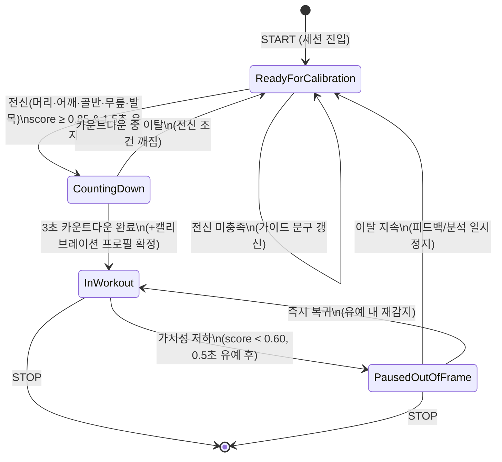

# 📌 작업 계획서: 운동 전 전신 측정 및 캘리브레이션 (Ready State) 구현

> **문서 성격**: 코드 작업 전 **승인용 상세 구현 설계서**입니다. 이 문서는 실제 코드 작업자가 바로 구현에 착수할 수 있도록 파일 경로·클래스·메서드·필드·상수 수준까지 명세합니다. 승인 전에는 `.cs` 코드 파일을 수정하지 않습니다.
>
> **PBI**: PBI-109 · **Linear**: [AI-146](https://linear.app/ai-healthcare-coach/issue/AI-146)
> **MVP 포지셔닝**: 피트니스 자세 코칭 보조. 의료 진단·치료·재활 처방이 아닙니다.
> **연관 문서**: [`docs/PBI109_PBI110_ImplementationPlan.md`](../docs/PBI109_PBI110_ImplementationPlan.md), [`plans/plan_user_onboarding_health_profile.md`](./plan_user_onboarding_health_profile.md)

## 1. 개요 및 목표
* 운동 시작 직전 사용자의 전신이 카메라 프레임에 완전히 위치했는지 검증하고, MediaPipe Pose의 ROI(Region of Interest) 및 랜드마크 트래킹을 안정화하는 **"전신 측정/캘리브레이션 3단계 상태 머신(Ready ➔ Countdown ➔ Workout)"**을 구축합니다.
* 운동 도중 전신 이탈(Out-of-Frame) 시 자동 일시정지 및 가이드 재진입 예외 처리를 포함하여 트래킹 안정성과 자세 분석 정확도를 극대화합니다.

## 2. 주요 작업 단계 (대표 작업 리스트)
- [x] **Step 1: Workout Tracking State Machine 설계 및 Enum 구축**
  - `RealtimeFeedbackOrchestrator.cs` 또는 상태 관리자에 `WorkoutTrackingState` Enum 정의 (`ReadyForCalibration`, `CountingDown`, `InWorkout`, `PausedOutOfFrame`)
  - 상태별 트래킹 플로우 제어 로직 구현
- [x] **Step 2: 전신 감지 캘리브레이션(Calibration) 검증 로직 개발**
  - MediaPipe 33개 관절 랜드마크의 `Visibility` / `Presence Score` 조건 검증 (주요 관절: 머리, 어깨, 골반, 무릎, 발목 score > 0.85f)
  - 전신 충족 조건이 1.5초 이상 안정적으로 유지 시 `CountingDown` 상태로 전환
- [x] **Step 3: 실루엣 가이드 및 캘리브레이션 UI 오버레이 연동**
  - 모바일 프리뷰 UI 상에 전신 영역 가이드 실루엣 표시
  - 전신 감지 상태 알림 (예: "카메라 뒤로 물러서주세요" ➔ "전신 감지 완료! 3초 후 시작합니다")
- [x] **Step 4: Out-of-Frame 예외 처리 및 자동 일시정지 로직**
  - 운동 중 관절 가시성(Visibility) 저하 시 `PausedOutOfFrame` 상태로 전환하여 오작동 방지
- [x] **Step 5: Linear PBI 등록 및 동기화**
  - Linear GraphQL API를 통해 PBI 이슈 생성 및 계획서 연동

## 3. 예상 예외 사항 및 제약 조건과 코드 구현이유
* **사전 전신 측정 도입 이유**: MediaPipe Pose는 첫 프레임에서 전신 Detector가 잡은 ROI를 바탕으로 연속 Tracker를 실행하므로, 전신이 온전히 들어온 상태에서 시작해야 운동 중 랜드마크 튐(Jitter)과 각도 왜곡이 방지됩니다.
* **1.5초 유지 조건 도입 이유**: 일시적인 관절 인식 순간 반응으로 인한 오작동을 방지하고 필터(EMA)가 충분히 안정화(Warm-up)되도록 보장합니다.

---

# 상세 구현 설계 (확장)

## 5. 기존 코드 자산과 신규 컴포넌트의 역할 분리

PBI-109는 "세션 단위 상태 머신"이라는 **신규 관심사**를 추가합니다. 기존 자산의 역할을 침범하지 않고, 기존 프레임 단위 품질 평가 결과를 소비(consume)하는 상위 레이어로 설계합니다.

| 자산 | 위치 | 기존 역할 | PBI-109에서의 관계 |
| --- | --- | --- | --- |
| `PoseTrackingQualityEvaluator` | `Rag/Runtime/PoseTrackingQuality.cs` | **프레임 단위** 원시 랜드마크 품질 평가 → `Good/Degraded/Unavailable`, `AllowsPoseAnalysis`. 핵심 관절 어깨·골반·무릎·발목. 기본 confidence 0.45, `trackingQualityGoodFrames`=3프레임. | **재사용(입력원)**. 상태 머신이 매 프레임 이 리포트를 읽어 전이 판단의 1차 신호로 사용. **수정하지 않음** (분석 게이트 임계와 캘리브레이션 임계는 별개). |
| `PoseCalibrationService` | `Pose/Calibration/PoseCalibrationService.cs` | 20프레임 신체 비율/바닥선 샘플링 → 정규화 프로필(`centerX`, `floorY`, `bodyScale`…) 생성. confidence 기본 0.55. | **재사용(협력)**. Countdown 진입 시점에 샘플링을 트리거해 `PoseCalibrationProfile`을 확정하는 훅으로 사용. **세션 상태 머신 아님**. |
| `FloorReferenceEstimator` | `Pose/Calibration/FloorReferenceEstimator.cs` | 바닥 기준선 추정. | 캘리브레이션 프로필 보강에 선택적으로 활용(변경 없음). |
| `RealtimeFeedbackOrchestrator` | `Rag/Runtime/RealtimeFeedbackOrchestrator.cs` | 프레임마다 quality 평가 → 분석/피드백. `Start`에서 즉시 tracking 가능. `WorkoutTrackingState` 없음. | **연동 대상**. 분석 파이프라인을 상태 머신 게이트 뒤로 이동(`InWorkout`일 때만 규칙 평가). |
| `PoseStatusIndicator` | `Pose/Rendering/PoseStatusIndicator.cs` | `Searching/Ready/AdjustCamera/Warning/Pause` 아이콘. | **재사용/확장**. 캘리브레이션 단계별 아이콘·문구 매핑에 활용. |
| `MobileWorkoutPrototypeView` | `UI/MobileWorkoutPrototypeView.cs` | UI Toolkit 플로우(+ `ScreenStep.Calibration`), `workoutRunning`, 전용 캘리브 화면 후 운동. | **연동 대상**. 프로필→캘리브→운동, START 시 캘리브 스킵 가능. |

**핵심 분리 원칙**
- `PoseTrackingQualityEvaluator`는 "이 프레임을 분석해도 되는가?"(analysis-ready)를 판단한다. 기본 임계(0.45)를 그대로 유지한다.
- 신규 `FullBodyCalibrationEvaluator`는 "지금 세션을 시작할 만큼 전신이 안정적으로 잡혔는가?"(session-start-ready)를 **더 엄격한 임계(0.85)** 와 **시간 유지(1.5초)** 로 판단한다.
- `WorkoutSessionStateMachine`은 위 두 신호를 받아 세션 수명 주기(Ready→Countdown→Workout→Paused)를 관리한다.

## 6. 신규 파일 및 배치

Linear 지정 경로 `Assets/Scripts/RagHealthcare/Pose/` 하위에 `Session/` 서브폴더를 신설합니다.

| 신규 파일 | 네임스페이스(제안) | 책임 |
| --- | --- | --- |
| `Pose/Session/WorkoutTrackingState.cs` | `Rag.Healthcare.Pose.Session` | 상태 enum + 상태별 표시 메타 정의 |
| `Pose/Session/FullBodyCalibrationEvaluator.cs` | `Rag.Healthcare.Pose.Session` | 전신 랜드마크(머리·어깨·골반·무릎·발목) 0.85 임계 + 1.5초 유지 판정 |
| `Pose/Session/WorkoutSessionStateMachine.cs` | `Rag.Healthcare.Pose.Session` | Ready→Countdown→Workout→Paused 전이·타이머·이벤트 |
| `Pose/Session/CalibrationSettings.cs` | `Rag.Healthcare.Pose.Session` | 임계/타이밍 튜닝 파라미터(Serializable) |
| `UI/Calibration/CalibrationOverlayView.cs` | `Rag.Healthcare.UI` | 실루엣 가이드 + 카운트다운 + 안내 문구 렌더(UI Toolkit) |

## 7. 상태 머신 데이터 모델 (C# 필드 수준)

### 7.1 `WorkoutTrackingState` enum

```csharp
namespace Rag.Healthcare.Pose.Session
{
    public enum WorkoutTrackingState
    {
        ReadyForCalibration = 0, // 전신 감지 대기 (가이드 실루엣 표시)
        CountingDown        = 1, // 전신 1.5초 유지 완료 → 3초 카운트다운
        InWorkout           = 2, // 분석/피드백 활성
        PausedOutOfFrame    = 3  // 운동 중 이탈 → 일시정지, Ready 재진입 대기
    }
}
```

### 7.2 `CalibrationSettings` (Serializable, 인스펙터 노출)

```csharp
[System.Serializable]
public sealed class CalibrationSettings
{
    [Range(0f, 1f)]   public float calibrationVisibilityThreshold = 0.85f; // AC: score ≥ 0.85
    [Range(0.5f, 5f)] public float calibrationHoldSeconds        = 1.5f;  // AC: 1.5초 유지
    [Range(1f, 5f)]   public float countdownSeconds             = 3f;    // AC: 3초 카운트다운
    [Range(0f, 1f)]   public float pauseVisibilityThreshold      = 0.60f; // 운동 중 이탈 판정(히스테리시스: 시작보다 낮게)
    [Range(0.1f, 3f)] public float outOfFrameGraceSeconds        = 0.5f;  // 이탈 확정 전 유예
    [Range(0.1f, 3f)] public float reReadyDebounceSeconds        = 0.5f;  // Paused→Ready 재진입 디바운스
    public bool requireHeadLandmark = true;                                // 머리(코) 가시성 포함 여부
    public bool runCalibrationProfileSampling = true;                      // Countdown 중 PoseCalibrationService 샘플링
}
```

> **히스테리시스 근거**: 시작 임계(0.85)와 이탈 임계(0.60)를 다르게 두어, 시작 직후 경계값에서 Ready↔Workout이 반복 진동하는 현상을 방지합니다.

### 7.3 `FullBodyCalibrationReport` (재사용 인스턴스)

```csharp
public sealed class FullBodyCalibrationReport
{
    public bool  HeadVisible;      // nose(또는 ears) ≥ 임계
    public bool  ShouldersVisible; // left/right shoulder ≥ 임계
    public bool  PelvisVisible;    // left/right hip ≥ 임계
    public bool  KneesVisible;     // left/right knee ≥ 임계
    public bool  AnklesVisible;    // left/right ankle ≥ 임계
    public float MinimumGroupScore;// 위 그룹 중 최저 score
    public bool  AllFullBodyVisible => HeadVisible && ShouldersVisible && PelvisVisible && KneesVisible && AnklesVisible;
    public float HeldSeconds;      // 연속 충족 유지 시간
    public bool  IsCalibrated;     // HeldSeconds ≥ calibrationHoldSeconds
    public string GuidanceReason;  // "카메라 뒤로 물러서주세요" 등
}
```

> **주의(Open Question O-1)**: 기존 `PoseTrackingQualityEvaluator`의 핵심 관절에는 **머리(head)가 포함되지 않습니다**(어깨·골반·무릎·발목만). Linear AC는 "머리/어깨/골반/무릎/발목"을 요구하므로, 머리는 신규 `FullBodyCalibrationEvaluator`에서 `PoseJointNames.Nose`(또는 `LeftEar`/`RightEar` 보조)로 별도 검사합니다. `requireHeadLandmark`로 토글 가능하게 하여 정면/역광 상황의 오탐을 완화합니다.

## 8. 상태 전이 다이어그램



## 9. 상태 머신 핵심 API 설계 (`WorkoutSessionStateMachine`)

```csharp
public sealed class WorkoutSessionStateMachine
{
    public WorkoutTrackingState State { get; private set; } = WorkoutTrackingState.ReadyForCalibration;
    public float CountdownRemainingSeconds { get; private set; }
    public FullBodyCalibrationReport LatestCalibration { get; private set; }

    public event System.Action<WorkoutTrackingState> StateChanged;      // UI/오디오 반응
    public event System.Action<float> CountdownTicked;                  // 남은 초 갱신
    public event System.Action CalibrationConfirmed;                    // 프로필 샘플링 트리거

    public void BeginSession();                 // → ReadyForCalibration, 타이머/유지시간 초기화
    public void Tick(JointTrackingFrame frame,  // 매 pose 프레임 호출
                     PoseTrackingQualityReport quality,
                     float deltaSeconds);
    public void EndSession();                   // 종료(STOP)
    public bool AllowsPoseAnalysis => State == WorkoutTrackingState.InWorkout;
}
```

**전이 규칙 요약**
1. `ReadyForCalibration`에서 `FullBodyCalibrationEvaluator`가 `AllFullBodyVisible == true`인 프레임을 누적하고 `HeldSeconds`를 증가시킨다. `HeldSeconds ≥ calibrationHoldSeconds(1.5초)` → `CountingDown` 진입, `CountdownRemainingSeconds = countdownSeconds(3초)`.
2. `CountingDown`에서 매 `Tick`마다 `CountdownRemainingSeconds -= deltaSeconds`. 전신 조건이 깨지면 즉시 `ReadyForCalibration`으로 롤백(카운트다운 취소, 잘림 시 보류 AC). `0` 도달 시 `CalibrationConfirmed` 발생 → (옵션) `PoseCalibrationService` 프로필 확정 → `InWorkout`.
3. `InWorkout`에서 `quality.State`가 나쁘거나 그룹 최저 score < `pauseVisibilityThreshold(0.60)`가 `outOfFrameGraceSeconds(0.5초)` 지속되면 `PausedOutOfFrame`.
4. `PausedOutOfFrame`에서 `reReadyDebounceSeconds` 내 재감지되면 `InWorkout` 복귀, 그렇지 않으면 `ReadyForCalibration`으로 되돌려 재캘리브레이션(피드백/분석 정지 유지).

## 10. `RealtimeFeedbackOrchestrator` 연동 설계 (변경 지점)

현재 `HandleTrackingFrame`은 품질만 통과하면 즉시 분석합니다. 상태 머신 게이트를 추가합니다.

```20:29:Assets/Scripts/RagHealthcare/Rag/Runtime/RealtimeFeedbackOrchestrator.cs
        [Header("Runtime")]
        [SerializeField] private bool startTrackingOnStart = true;
        [SerializeField] private string exercise = "squat";
        [SerializeField, Range(0.5f, 3f)] private float analysisWindowSeconds = 1.2f;
```

**작업 단위 (설계):**
- 필드 추가: `private readonly WorkoutSessionStateMachine sessionState = new WorkoutSessionStateMachine();`, `[SerializeField] private CalibrationSettings calibrationSettings = new CalibrationSettings();`
- `HandleTrackingFrame` 흐름 변경:
  1. `LatestTrackingQuality = trackingQualityEvaluator.Evaluate(...)` (기존 유지)
  2. `sessionState.Tick(frame, LatestTrackingQuality, Time.deltaTime)`
  3. `if (!sessionState.AllowsPoseAnalysis) { SuspendPoseAnalysis(...); return; }` — 즉, `InWorkout`이 아니면 규칙 평가·피드백을 실행하지 않음
  4. 이후 기존 stabilizer→feature→phase→rule 파이프라인 유지
- 세션 시작 시점: 기존 즉시 `StartTracking()` 대신 UI START가 `sessionState.BeginSession()` 호출 후 tracking. `startTrackingOnStart` 기본값 검토(Open Question O-2).
- 신규 public 노출: `public WorkoutTrackingState SessionState => sessionState.State;`, `public float CountdownRemaining => sessionState.CountdownRemainingSeconds;` (UI 바인딩용)

> **비침습 원칙**: 기존 rearm 로직(`requiresStandingRearm`)과 `SuspendPoseAnalysis`는 그대로 두고, 그 앞단에 상태 게이트만 추가합니다. `PausedOutOfFrame` 진입 시 기존 `SuspendPoseAnalysis`를 재사용하여 윈도우/피처를 초기화합니다.

## 11. UI 오버레이 설계 (`CalibrationOverlayView` + `MobileWorkoutPrototypeView` 연동)

`MobileWorkoutPrototypeView`에는 프로필 이후 **전용 `ScreenStep.Calibration` 화면**이 있습니다. 흐름은 **프로필 → 전신 캘리브레이션 → 운동 선택/세션**입니다. 이번 실행에서 캘리브가 완료되면 운동 START 시 Ready/Countdown을 건너뛰고 `InWorkout`로 바로 진입합니다. 세션 스텝의 `BuildPreviewPanel()` 위에는 기존과 같이 캘리브레이션 오버레이 레이어가 있습니다.

- [x] 전용 `ScreenStep.Calibration` (프로필 완료 후 / 이번 실행 캘리브 미완료 시)
- [x] 캘리브 완료 CTA → `ScreenStep.Exercise`, START 시 `BeginCalibratedSession` 스킵 경로

| 상태 | 실루엣 가이드 | 안내 문구(예시) | `PoseStatusIcon` 매핑 |
| --- | --- | --- | --- |
| `ReadyForCalibration` (전신 미충족) | 반투명 전신 실루엣 표시(점멸) | "카메라 뒤로 물러서주세요 / 전신이 보이도록 서 주세요" | `Searching` / `AdjustCamera` |
| `ReadyForCalibration` (충족 진행 중) | 실루엣 테두리 채워짐(0→1.5초 진행바) | "자세를 유지하세요…" | `AdjustCamera` |
| `CountingDown` | 실루엣 초록, 큰 숫자 3·2·1 | "전신 감지 완료! 3초 후 시작합니다" | `Ready` |
| `InWorkout` | 오버레이 숨김(스켈레톤만) | (기존 phase/피드백 표시) | `Ready` |
| `PausedOutOfFrame` | 실루엣 재표시(주황) | "전신이 화면을 벗어났어요. 다시 프레임 안으로 들어와 주세요" | `Pause` |

**세부 사항**
- 문구 상수는 `CalibrationOverlayView`에 `private const string` 로 정의(기존 `PoseTrackingQualityEvaluator`의 `ReasonClipped` 등 톤과 일관).
- 카운트다운 숫자는 `CountdownTicked` 이벤트를 구독해 `Mathf.CeilToInt(remaining)`로 표기.
- 실루엣은 UI Toolkit `VisualElement` + `generateVisualContent`(기존 `OnGeneratePoseOverlayContent` 패턴 재사용) 또는 사전 준비된 실루엣 텍스처. MVP는 벡터 라인 실루엣 권장.
- 음성 안내(선택): 기존 `CoachTtsController.BeginSession()` 호출 시점을 `CountingDown` 완료 직후로 이동 검토.

## 12. 임계값·상수 요약표

| 상수 | 값 | 위치(제안) | 근거 |
| --- | --- | --- | --- |
| 캘리브레이션 가시성 임계 | `0.85f` | `CalibrationSettings.calibrationVisibilityThreshold` | Linear AC |
| 전신 유지 시간 | `1.5f` 초 | `CalibrationSettings.calibrationHoldSeconds` | Linear AC / EMA warm-up |
| 카운트다운 | `3f` 초 | `CalibrationSettings.countdownSeconds` | Linear AC |
| 이탈 판정 임계 | `0.60f` | `CalibrationSettings.pauseVisibilityThreshold` | 히스테리시스 |
| 이탈 유예 | `0.5f` 초 | `CalibrationSettings.outOfFrameGraceSeconds` | 순간 가림 무시 |
| 재진입 디바운스 | `0.5f` 초 | `CalibrationSettings.reReadyDebounceSeconds` | 진동 방지 |

> **기존 불일치 해소**: `RealtimePoseRuleSettings.trackingQualityGoodFrames`(기본 3프레임, 약 0.25초 @12fps)는 **분석 게이트**용으로 유지합니다. 캘리브레이션의 1.5초/0.85는 별도 `CalibrationSettings`로 관리하여, "프레임 기반 분석 준비"와 "시간 기반 세션 시작 준비"를 명확히 분리합니다.

## 13. 구현 순서 (Phase)

### Phase A — 상태 머신 코어 (UI 없음, 순수 로직)
- **수정/신규 파일**: `Pose/Session/WorkoutTrackingState.cs`, `FullBodyCalibrationEvaluator.cs`, `WorkoutSessionStateMachine.cs`, `CalibrationSettings.cs` (모두 신규)
- **작업 단위**: enum·설정·평가기·상태 머신 전이 로직, 이벤트 발행
- **수용 테스트 시나리오**
  - AT-A1: 전신 가시성 ≥0.85가 1.5초 미만 유지 → `ReadyForCalibration` 유지, `CountingDown` 진입 안 함
  - AT-A2: ≥0.85가 1.5초 연속 유지 → `CountingDown` 진입, 남은 시간 3.0초
  - AT-A3: 카운트다운 중 하체(발목) 가시성 하락 → 즉시 `ReadyForCalibration` 롤백
  - AT-A4: 카운트다운 3초 경과 → `CalibrationConfirmed` 1회 발생 후 `InWorkout`

### Phase B — 오케스트레이터 게이트 연동
- **수정 파일**: `Rag/Runtime/RealtimeFeedbackOrchestrator.cs`
- **작업 단위**: `sessionState.Tick` 삽입, `AllowsPoseAnalysis` 게이트, public 상태 노출, START 흐름에서 `BeginSession()` 호출
- **수용 테스트 시나리오**
  - AT-B1: `InWorkout` 이전에는 `LatestStats == null` (규칙 평가 미실행)
  - AT-B2: `InWorkout` 진입 후 스쿼트 프레임 주입 → 기존 phase/rep 카운트 정상 동작(회귀 없음)
  - AT-B3: `PausedOutOfFrame` 진입 시 기존 `SuspendPoseAnalysis` 경로로 윈도우 초기화

### Phase C — UI 오버레이
- **수정/신규 파일**: `UI/Calibration/CalibrationOverlayView.cs`(신규), `UI/MobileWorkoutPrototypeView.cs`(오버레이 추가·이벤트 구독)
- **작업 단위**: 실루엣·진행바·카운트다운 숫자·상태별 문구, `PoseStatusIndicator` 연계
- **수용 테스트 시나리오**
  - AT-C1: Ready 상태에서 "물러서주세요" 계열 문구 표시
  - AT-C2: 카운트다운 3·2·1 숫자가 초 단위로 감소
  - AT-C3: `InWorkout` 진입 시 실루엣 숨김, 스켈레톤 오버레이만 표시
  - AT-C4: 운동 중 프레임 이탈 → 주황 실루엣 + "프레임 안으로" 문구, 피드백 정지

### Phase D — 캘리브레이션 프로필 연동(선택/MVP+)
- **수정 파일**: 상태 머신 ↔ `PoseCalibrationService` 훅
- **작업 단위**: `CountingDown` 동안 프레임 샘플 축적 → `Build()`로 `PoseCalibrationProfile` 확정, 정규화 사용처에 전달
- **수용 테스트 시나리오**: AT-D1: 카운트다운 종료 시 `profile.valid == true`, `bodyScale > 0.2`

## 14. 검증 계획
- **에디터 재생 검증**: 합성 33-landmark fixture(참고: `PBI-093` 4종 fixture)로 상태 전이 결정론 검증. 사람/실기기 없이 Phase A/B 자동 검증 가능.
- **실기기 검증(외부 증거)**: 전신 프레이밍 거리, 역광, 하체 잘림, 운동 중 이탈 시나리오. `docs/qa/device-matrix.md` 단말에서 수동.
- **회귀 검증**: 기존 스쿼트 rep 카운트/피드백이 `InWorkout` 이후 동일하게 동작하는지.

## 15. 리스크 및 미결 결정 (Open Questions)
- **O-1 (머리 랜드마크)**: 머리 포함 시 역광/모자 착용에서 오탐 가능. `requireHeadLandmark` 기본값(true/false) 확정 필요.
- **O-2 (`startTrackingOnStart`)**: 상태 머신 도입 후에도 자동 tracking 시작을 유지할지, UI START에서만 시작할지. 성능 벤치(카메라 warm) 영향 검토.
- **O-3 (이탈 임계 튜닝)**: 0.60 임계와 0.5초 유예가 실기기에서 과민/둔감한지 튜닝 필요.
- **O-4 (캘리브레이션 프로필 필수 여부)**: Phase D를 MVP 필수로 볼지, 후속으로 뺄지.
- **O-5 (좌표계/미러)**: 실루엣 가이드와 전면 카메라 셀피 미러링(기존 `PoseDisplayCoordinateMapper`)의 좌우 정합.

## 16. MVP 범위 vs 후속
- **MVP**: Phase A·B·C. 상태 머신 + 게이트 + 기본 실루엣/카운트다운 UI.
- **후속(MVP+)**: Phase D(정규화 프로필 확정), 실루엣 텍스처 고도화, 다중 운동(런지 등) 프레이밍 프로필, 캘리브레이션 텔레메트리 로깅.

## 4. 완료 정의 (Definition of Done)
- [ ] 작성한 `plan_full_body_calibration.md` 파일의 모든 작업 단계 체크박스가 `[x]`로 완료 표시되었는가?
- [ ] 수정된 Unity C# 소스 코드와 계획서가 Git에 정상적으로 커밋 및 푸시되었는가?
- [ ] 수정된 기능에 대해 빌드/테스트 에러가 없음을 확인하였는가?
- [ ] Linear PBI 이슈가 자동으로 생성/업데이트되고 'In Progress' / 'Done'으로 관리되었는가?
- [ ] `ReadyForCalibration → CountingDown → InWorkout → PausedOutOfFrame` 4상태 전이가 결정론적으로 검증되었는가?
- [ ] `InWorkout` 이전에는 분석/피드백이 실행되지 않음(게이트)이 확인되었는가?
- [ ] 캘리브레이션 임계(0.85)·유지(1.5초)·카운트다운(3초)가 AC와 일치하는가?
