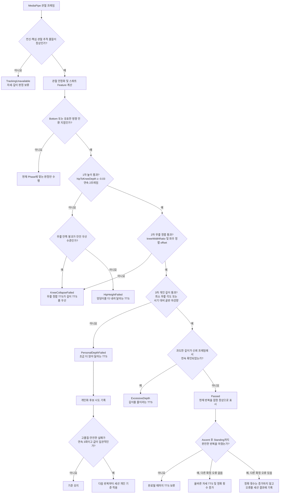

# 순차형 개인 맞춤 스쿼트 최저점·TTS 판정 변경 계획

작성일: 2026-07-27
상태: 코드 구현·결정론 QA·iOS 빌드/설치 완료, iPhone 실제 스쿼트 검증 대기

## 1. 목표

- 스쿼트 최저점에서 여러 오류 후보를 동시에 만든 뒤 점수로 경쟁시키는 대신,
  사용자가 이해하기 쉬운 **순차 판정 결과 하나**를 만든다.
- 다음 실패 원인을 서로 다른 TTS로 명확히 구분한다.
  1. 엉덩이–무릎 높이 미달
  2. 무릎이 안쪽으로 모이는 정렬 오류
  3. 개인 목표 깊이 미달
  4. 과도한 깊이
- 반복해서 같은 개인 목표 깊이만 통과하지 못하는 사용자는 추적 품질과 자세
  안전성을 확인한 뒤 현재 세션에서만 깊이 기준을 제한적으로 보정한다.
- 올바른 자세 안내는 최저점에서 즉시 말하지 않고, 상승 후 다시 선 시점에
  완전한 반복이 확인되었을 때 출력한다.

## 2. 검토 결론

사용자가 제안한 방식의 핵심인 **“1차 → 무릎 정렬 → 개인 깊이 → 성공” 순차
구조를 채택**한다. 현재 방식보다 어떤 조건에서 어떤 TTS가 나왔는지 추적하기
쉽고, 한 최저점에서 상반되는 깊이 안내가 경쟁하는 문제도 줄일 수 있다.

다만 다음 두 부분은 그대로 적용하지 않고 보정한다.

### 2.1 엉덩이는 무릎보다 정확히 아래가 아니라 허용 범위를 둔다

전면 카메라 2D 좌표에서는 카메라 높이, 골반 회전, 관절 추정 오차 때문에 정상
깊이에서도 엉덩이가 무릎보다 조금 위로 보일 수 있다. 따라서 기존과 같이
신체 크기로 정규화한 값을 사용한다.

```text
hipToKneeDepth =
    (hipCenterY - kneeCenterY) / bodyScale
```

- 권장 통과 기준: `hipToKneeDepth >= -0.03`
- 최소 연속 확인: 신뢰 가능한 프레임 `2개`
- 개인화가 이루어져도 이 1차 기준은 완화하지 않는다.

사용자가 원한 엄격한 “무릎보다 아래”는 `0`이지만, 실기기 전면 카메라에서는
거짓 실패가 늘어날 가능성이 커 기본값으로는 `-0.03`을 유지한다.

### 2.2 무릎–발 선은 깊이가 아니라 무릎 정렬 판정에 사용한다

무릎에서 발까지의 선과 엉덩이 점의 거리는 카메라 각도에 따라 크게 달라지고
실제 스쿼트 깊이와 일대일로 대응하지 않는다. 따라서 이 값은 깊이 합격 기준으로
사용하지 않는다.

대신 무릎이 안쪽으로 모이는 현상은 다음 값으로 판정한다.

```text
kneeWidthRatio =
    distance(leftKnee.x, rightKnee.x)
    / distance(leftAnkle.x, rightAnkle.x)
```

- 발목 간격이 너무 작거나 양발이 보이지 않으면 판정을 보류한다.
- 좌우 반전과 신체 크기에 영향을 덜 받도록 비율을 사용한다.
- 초기 후보 기준: `kneeWidthRatio < 0.80`
- 기존 무릎–고관절–발목 정렬 offset도 함께 확인해 단순한 좁은 스탠스를
  무릎 붕괴로 잘못 판단하지 않게 한다.
- 최소 `2개` 신뢰 프레임 또는 최근 유효 프레임의 `35%` 이상에서 확인한다.
- 실제 기준값은 합성 fixture와 실기기 정면 촬영으로 조정한다.

## 3. 새 판정 결과 모델

최저점 판정 결과를 여러 boolean과 후보 목록으로 흩어 놓지 않고 다음 중 하나의
결과로 확정한다.

```text
SquatBottomDecision
  TrackingUnavailable
  NotAtBottom
  HipHeightFailed
  KneeCollapseFailed
  PersonalDepthFailed
  ExcessiveDepth
  Passed
```

한 최저점 시도는 하나의 `SquatBottomDecision`만 갖는다. 이 결과와 TTS 문장을
일대일로 연결해 같은 순간에 “더 내려가세요”와 “너무 깊습니다”가 함께 후보가
되는 것을 막는다.

## 4. 제안 판정 순서



## 5. 단계별 TTS

| 판정 결과 | 발생 조건 | 제안 TTS | 출력 정책 |
| --- | --- | --- | --- |
| `TrackingUnavailable` | 핵심 관절 신뢰도 또는 전신 프레이밍 부족 | `카메라에 전신이 보이도록 위치를 조정해 주세요.` | 자세 TTS보다 우선 |
| `HipHeightFailed` | 1차 높이 조건이 연속 2프레임 확인되지 않음 | `엉덩이와 무릎 높이가 충분히 가까워지지 않았습니다. 엉덩이를 조금 더 내려 주세요.` | 반복당 최대 1회 |
| `KneeCollapseFailed` | 무릎 간격이 발목 간격보다 비정상적으로 좁고 정렬 offset도 위반 | `무릎이 안쪽으로 모입니다. 무릎을 발끝 방향으로 조금 벌려 주세요.` | 깊이 안내보다 안전 우선 |
| `PersonalDepthFailed` | 1차와 무릎 정렬은 통과했지만 무릎 각도·골반 하강 목표 모두 미달 | `정렬은 좋습니다. 현재 가능한 범위에서 조금 더 앉아 주세요.` | 반복당 최대 1회 |
| `ExcessiveDepth` | 개인 깊이는 통과했지만 과도한 굽힘이 연속 신뢰 프레임에서 확인됨 | `너무 깊게 내려갔습니다. 깊이를 조금 줄여 주세요.` | 단일 프레임 최솟값으로는 출력 금지 |
| `Passed` | 전체 반복 완료 및 다른 확정 Warning 없음 | `올바른 자세입니다. {N}개.` | `Standing` 복귀 후 출력 |
| 개인 기준 적용 | 적격 실패 3회로 런타임 기준을 보정함 | `현재 가능한 깊이에 맞춰 기준을 조정했습니다.` | 세션당 최대 1회, 동작 종료 후 출력 |

고정된 원인별 문장은 `PreferTemplateText`를 사용해 RAG 문구가 다른 의미로
교체하지 못하게 한다.

## 6. 개인 깊이 판정

3차 깊이는 무릎–발 선과 엉덩이 점의 거리 대신 기존에 검증된 두 값을 사용한다.

```text
anglePass =
    minimumKneeAngleInCurrentRep <= activeMaximumKneeAngle

hipDropPass =
    maximumHipDropInCurrentRep >= activeMinimumHipDrop

personalDepthPass = anglePass OR hipDropPass
```

초기 기준:

- `activeMaximumKneeAngle = 135°`
- `activeMinimumHipDrop = 0.08`

두 값 중 하나라도 만족하면 체형과 동작 스타일 차이를 허용한다. 단, 1차
엉덩이–무릎 높이 조건과 무릎 정렬 조건은 별도로 통과해야 한다.

## 7. 런타임 개인화

### 7.1 개인화 후보로 인정하는 실패

다음 조건을 모두 만족한 `PersonalDepthFailed`만 수집한다.

- 추적 품질이 `Good`이다.
- 1차 엉덩이–무릎 높이 조건을 통과했다.
- 무릎 안쪽 붕괴가 없다.
- 상체·중심·골반에서 확정 Warning이 없다.
- 방향 전환 또는 최저점 정지 구간이 확인되었다.
- 최소 무릎 각도와 최대 골반 하강량이 유효하다.

`HipHeightFailed`, `KneeCollapseFailed`, 추적 실패, 단일 프레임 튐은 개인화
근거로 사용하지 않는다.

### 7.2 적용 시점

- 적격 후보가 연속 `3회` 쌓이면 값의 일관성을 검사한다.
- 무릎 각도 범위가 약 `8°` 이내이고 골반 하강량 범위가 `0.02` 이내일 때만
  사용자의 반복 가능한 한계로 본다.
- 세 번째 실패를 소급해 성공으로 바꾸지 않고 **다음 반복부터** 적용한다.
- 개인화 기준은 현재 운동 세션에서만 유지하고 새 세션에서 초기화한다.
- 영구 저장은 여러 세션 검증과 사용자 동의가 필요한 후속 범위로 둔다.

### 7.3 보정식과 절대 제한

```text
learnedMaximumKneeAngle =
    clamp(median(최근 3회 최소 무릎 각도) + 3°, 135°, 150°)

learnedMinimumHipDrop =
    clamp(median(최근 3회 최대 골반 하강량) - 0.01, 0.05, 0.08)
```

- 무릎 각도 허용치는 최대 `150°`까지만 완화한다.
- 골반 하강 기준은 최소 `0.05` 아래로 낮추지 않는다.
- 1차 `hipToKneeDepth >= -0.03` 조건은 절대 완화하지 않는다.
- 과도한 깊이 기준과 사용자 부상 프로필의 안전 제한은 완화하지 않는다.
- 개인화 이후에도 무릎 정렬 또는 다른 Warning이 있으면 올바른 반복으로
  인정하지 않는다.

## 8. 과도한 깊이 오판 방지

현재 과도한 깊이는 이번 반복의 무릎 각도 최솟값 하나가 기준 미만이면 후보가
될 수 있다. 다음과 같이 바꾼다.

- 좌우 평균 무릎 각도가 과도한 깊이 기준 미만인 신뢰 프레임을 연속
  `2개` 이상 요구한다.
- 좌우 무릎 중 한쪽만 순간적으로 접히거나 가려진 프레임은 제외한다.
- 최근 창의 위반 비율도 최소 기준을 통과해야 한다.
- 개인 프로필에 따른 과도한 깊이 기준은 유지한다.
  - 기본 `55°`
  - 무릎 보호 프로필 `80°`
  - 허리 보호 프로필 `70°`
- 조건이 회복된 뒤 아직 시작하지 않은 과도한 깊이 TTS는 취소한다.

## 9. TTS 충돌 방지 정책

- 한 최저점 시도에서 깊이·정렬 관련 결정은 하나만 확정한다.
- 기본 순서는 `추적 품질 → 1차 높이 → 무릎 정렬 → 개인 깊이 → 과도한 깊이`
  이다.
- 단, 명확한 무릎 안쪽 붕괴는 사용자가 더 깊게 내려가도록 유도하지 않도록
  1차 깊이 실패 TTS보다 우선할 수 있다.
- `Passed`는 최저점에서 말하지 않고 전체 반복 완료 후 말한다.
- 자세가 교정되거나 `Ascent`/`Standing`으로 전환되면 아직 시작하지 않은
  `squat_*` TTS를 취소한다.
- 각 판정에는 독립적인 semantic ID를 사용한다.
  - `squat_depth_hip_height`
  - `squat_knee_collapse`
  - `squat_depth_personal_target`
  - `squat_depth_excessive`
  - `correct_rep_{N}`

## 10. 예상 코드 변경 범위

| 파일 | 변경 내용 |
| --- | --- |
| `PoseFeatureFrame.cs` | 무릎/발목 폭, 무릎 안쪽 붕괴 비율과 유효성 추가 |
| `PoseFeatureExtractor.cs` | 좌우 반전에 독립적인 `kneeWidthRatio` 계산 |
| `PoseWindowStats.cs` | 무릎 붕괴와 과도한 깊이 연속·지속 통계 추가 |
| `RealtimePoseRuleSettings.cs` | 무릎 폭 비율, 연속 프레임, 개인화 범위 설정 추가 |
| `ExercisePhaseState.cs` | `SquatBottomDecision`, 반복별 gate 결과와 개인화 후보 상태 추가 |
| `ExercisePhaseDetector.cs` | 최저점 시도 확정, 연속 프레임 및 개인화 샘플 관리 |
| `RealtimePoseRuleEngine.cs` | 후보 다중 생성 대신 순차형 최저점 결정과 원인별 고정 문장 생성 |
| `RealtimeFeedbackOrchestrator.cs` | 반복 완료 시 성공 TTS, 개인화 적용 안내, 오래된 대기 TTS 취소 |
| `MobileWorkoutPrototypeView.cs` | 디버그 상태에 1차/정렬/개인 깊이/적응 기준 표시 |
| `HealthcareQaSuite.cs` | 순차 판정, 배타적 TTS, 개인화 안전장치 회귀 테스트 추가 |
| `current-pose-decision-logic.md` | 실제 최종 판정 순서와 임계값 갱신 |

## 11. 구현 단계

- [x] `SquatBottomDecision`과 단계별 진단 evidence 계약을 정의한다.
- [x] `kneeWidthRatio`와 정렬 신뢰도 계산을 추가한다.
- [x] 1차 높이, 무릎 정렬, 개인 깊이, 과도한 깊이를 하나의 순차 판정으로
      통합한다.
- [x] 판정 결과별 고정 TTS와 semantic ID를 적용한다.
- [x] 적격 실패 3회 기반 세션 개인화와 절대 제한을 구현한다.
- [x] 성공 TTS를 최저점이 아니라 완전한 반복 종료 시 출력한다.
- [x] 교정된 자세와 phase 전환 시 오래된 대기 TTS를 취소한다.
- [x] 상태 UI와 세션 로그에 각 gate의 실제 측정값과 실패 이유를 기록한다.
- [ ] 합성 프레임 QA와 실기기 정면 스쿼트 테스트를 수행한다.
  - [x] Unity 6000.3.18f1 임시 프로젝트 결정론 QA
  - [x] iOS ReleaseForRunning 빌드 및 iPhone 설치
  - [ ] iPhone 잠금 해제 후 정면 스쿼트·TTS 실동작
- [x] 문서와 계획서의 검증 항목을 완료 상태로 갱신한다.

## 12. QA 시나리오

- [x] 엉덩이가 충분히 내려가지 않은 반복은 `HipHeightFailed` 하나만 출력한다.
- [x] 1차 통과 후 무릎이 안쪽으로 모이면 `KneeCollapseFailed`만 출력한다.
- [x] 1차·정렬 통과 후 깊이가 부족하면 `PersonalDepthFailed`만 출력한다.
- [x] 정상 반복은 최저점에서 성공 TTS를 말하지 않고 `Standing` 복귀 후
      `올바른 자세입니다. {N}개.`를 출력한다.
- [x] 과도한 깊이 한 프레임 튐은 무시하고 연속 신뢰 프레임에서만 경고한다.
- [x] 적격 깊이 실패 1~2회는 기준을 바꾸지 않는다.
- [x] 일관된 적격 실패 3회 후 다음 반복부터 제한 범위 안에서 기준이 적용된다.
- [x] 낮은 신뢰도, 무릎 붕괴, 상체 Warning이 섞인 실패는 개인화에 사용하지 않는다.
- [x] 개인화 이후에도 1차 높이 기준과 과도한 깊이 안전 기준은 유지된다.
- [x] 같은 최저점에서 “더 내려가세요”와 “너무 깊습니다”가 함께 예약되지 않는다.
- [x] 좌우 반전, 사용자 크기 변화, 카메라 거리 변화에도 무릎 붕괴 비율 판정이
      동일하게 유지된다.

## 13. 완료 기준

- 최저점마다 하나의 명확한 판정 결과와 하나의 원인별 TTS만 생성된다.
- 사용자가 어떤 조건을 실패했는지 UI·로그·TTS에서 같은 의미로 확인할 수 있다.
- 사용자의 반복 가능한 깊이를 세션 안에서 보정하되 잘못된 자세나 추적 오류를
  학습하지 않는다.
- 기준 보정이 절대 높이 하한, 무릎 정렬, 과도한 깊이 안전 기준을 우회하지 않는다.
- Unity 컴파일, Healthcare QA Suite, iPhone 실기기 테스트가 모두 통과한다.
