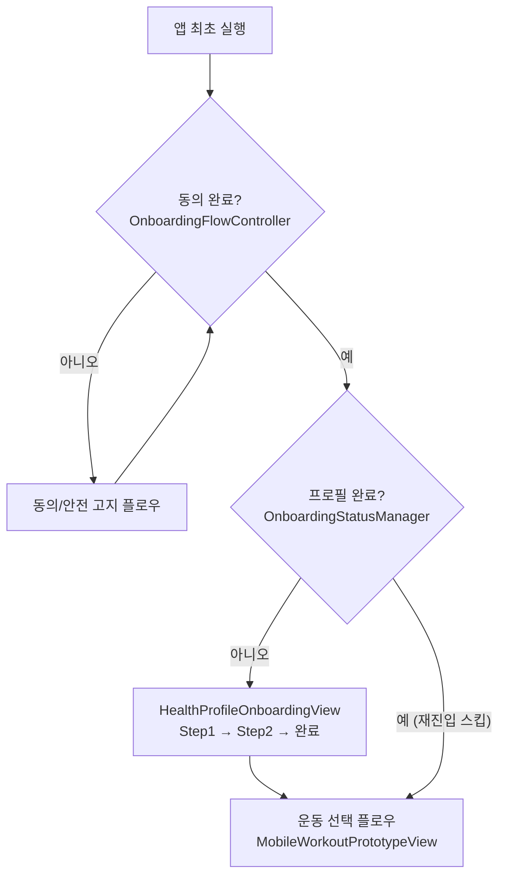

# 📌 작업 계획서: 신규 사용자 건강 상태 및 운동 프로필 수집 온보딩 체계 구현 (PBI-110)

> **문서 성격**: 코드 작업 전 **승인용 상세 구현 설계서**입니다. 실제 코드 작업자가 바로 구현할 수 있도록 파일 경로·클래스·메서드·필드·상수 수준까지 명세합니다. 승인 전에는 `.cs` 코드 파일을 수정하지 않습니다.
>
> **PBI**: PBI-110 · **Linear**: [AI-147](https://linear.app/ai-healthcare-coach/issue/AI-147)
> **MVP 포지셔닝**: 피트니스 코칭용 프로필 수집. 수집한 부상 이력은 **안전 보정(safety derate)** 코칭 파라미터 조정에만 사용하며, 의료 진단·치료·재활 처방이 아닙니다.
> **연관 문서**: [`docs/PBI109_PBI110_ImplementationPlan.md`](../docs/PBI109_PBI110_ImplementationPlan.md), [`plans/plan_full_body_calibration.md`](./plan_full_body_calibration.md)

## 1. 개요 및 목표
* 사용자가 앱을 최초 실행할 때 신체 데이터(나이, 성별, 키, 몸무게) 및 운동 이력/목적/부상 정보(부상 이력, 운동 장소/기구, 주당 횟수, 숙련도)를 수집하는 **신규 사용자 온보딩 수집 체계**를 구축합니다.
* 수집된 데이터를 바탕으로 개인별 맞춤형 관절 가동 범위(ROM), 스쿼트 뎁스 안전 보정 및 운동 추천 파라미터를 도출하여 데이터베이스 및 RAG 시스템과 연동하는 기반을 제공합니다.

## 2. 주요 작업 단계 (대표 작업 리스트)
- [ ] **Step 1: 온보딩 사용자 프로필 데이터 모델 (`UserProfileData.cs`) 설계**
  - 신체 정보: 나이, 성별, 키, 몸무게, (TODO: InBody / Apple Health / Google Fit 연동 인터페이스 훅)
  - 운동 이력 정보: 부상 부위/이력, 운동 목적, 운동 장소/기구, 주당 운동 횟수, 운동 숙련도
  - 맞춤 파라미터: 관절 가동 범위 (ROM Thresholds), 권장 뎁스, 초기 모니터링 강도
- [ ] **Step 2: 신규 사용자 판별 및 온보딩 플로우 구현**
  - 앱 최초 진입 시 온보딩 완료 여부 검사 (`OnboardingStatusManager`)
  - 신규 사용자일 경우 온보딩 수집 UI 뷰(OnboardingProfileView)로 단계별 전환
- [ ] **Step 3: 온보딩 UI 스텝 작성 (Step 1: 신체 기본정보 / Step 2: 운동 이력 및 부상)**
  - UI Toolkit / Canvas 기반 스텝별 입력 및 선택 폼 작성
  - 부상 부위 선택 시 관절 가동 범위(ROM) 안전 보정 알고리즘 자동 매핑
- [ ] **Step 4: 로컬 DB / JSON 저장 및 RAG 피드백 엔진 연동**
  - 수집 데이터를 Encrypted Local DB / JSON 저장
  - `RealtimePoseRuleSettings` 및 RAG 컨텍스트 프롬프트에 사용자 프로필 정보 바인딩
- [ ] **Step 5: Linear PBI 이슈 등록 및 동기화**
  - Linear GraphQL API를 통해 PBI-110 생성 및 계획 연동

## 3. 예상 예외 사항 및 제약 조건과 코드 구현이유
* **초기 프로필 수집 필요성**: 관절 가동 범위(ROM) 기준 및 통증 부위 주의 피드백은 사용자의 부상 이력과 숙련도에 따라 기준값이 달라져야 하므로, 운동 진입 전 사용자 상태 수집이 필수적입니다.
* **InBody 및 건강 데이터 연동 확장성 (TODO)**: 추후 iOS HealthKit / Android Google Fit 또는 인바디 OpenAPI를 확장할 수 있도록 인터페이스(`IHealthDataProvider`) 형태로 추상화합니다.

---

# 상세 구현 설계 (확장)

## 5. 기존 동의 온보딩(`OnboardingFlowController`)과의 공존 설계

기존 `Product/OnboardingFlowController.cs`는 **개인정보/카메라 목적/안전 고지 동의 + 컨디션 체크**를 담당하며 `PlayerPrefs` 키 `ahc.onboarding.v1`에 저장합니다. **건강 프로필은 다루지 않으며**, `OnboardingSnapshot.CanStartWorkout`은 동의 3종 + `condition == Ready`만 검사합니다.

```27:31:Assets/Scripts/RagHealthcare/Product/OnboardingFlowController.cs
        public bool CanStartWorkout =>
            privacyNoticeAccepted &&
            cameraPurposeAccepted &&
            safetyNoticeAccepted &&
            condition == ConditionCheck.Ready;
```

**공존 원칙 (관심사 분리)**
- `OnboardingFlowController`(동의·컨디션)는 **변경하지 않습니다**. 별도 관심사이며 키(`ahc.onboarding.v1`)도 그대로 둡니다.
- 신규 `OnboardingStatusManager`는 **건강 프로필** 완료 여부만 담당하고 별도 키 `ahc.profile.v1`을 사용합니다.
- **순서**: 앱 최초 실행 → (기존) 동의/안전 고지 플로우 → (신규) 건강 프로필 설문 → 운동 선택. 즉 동의 완료 후 프로필 설문을 배치합니다(동의 없이 카메라/데이터 수집 불가라는 기존 안전 원칙 유지).
- **게이트 관계**: 운동 시작 조건 = `OnboardingSnapshot.CanStartWorkout` (기존, 변경 없음) **AND** `OnboardingStatusManager.HasCompletedProfile` (신규). 두 게이트는 독립적으로 평가하며 서로의 코드를 침범하지 않습니다.
- **재진입 스킵(AC)**: `ahc.profile.v1`이 존재하고 `schemaVersion`이 유효하면 프로필 설문을 건너뜁니다. 설정 화면에서 "프로필 수정" / "재설정"을 제공(기존 `ResetConsent()` 패턴과 대칭).

## 6. 신규 파일 및 배치

| 신규 파일 | 네임스페이스(제안) | 책임 |
| --- | --- | --- |
| `Product/UserProfileData.cs` | `Rag.Healthcare.Product` | 프로필 직렬화 데이터 모델(신체·이력·부상·파생 파라미터) |
| `Product/OnboardingStatusManager.cs` | `Rag.Healthcare.Product` | 프로필 완료 판별·로드/저장(`ahc.profile.v1`)·이벤트 |
| `Product/Health/IHealthDataProvider.cs` | `Rag.Healthcare.Product.Health` | 건강 데이터 소스 추상화(TODO 훅) |
| `Product/Health/ManualHealthDataProvider.cs` | `Rag.Healthcare.Product.Health` | MVP 기본 구현(수동 입력값 그대로 반환) |
| `Rag/Runtime/PersonalizedRomEvaluator.cs` | `Rag.Healthcare.Rag.Runtime` | 프로필 → `RealtimePoseRuleSettings` 안전 보정 델타 산출 |
| `UI/Onboarding/HealthProfileOnboardingView.cs` | `Rag.Healthcare.UI` | 2단계 설문 UI(UI Toolkit) |

> `PersonalizedRomEvaluator`를 `Rag/Runtime`에 두는 이유: 산출 결과가 `RealtimePoseRuleSettings`(동일 네임스페이스)에 매핑되며, 런타임 규칙 엔진과 가까이 위치해야 하기 때문입니다.

## 7. 데이터 모델 (C# 필드 수준)

### 7.1 열거형

```csharp
namespace Rag.Healthcare.Product
{
    public enum Gender { Unspecified = 0, Male, Female, Other }

    [System.Flags]
    public enum InjuryRegions
    {
        None      = 0,
        Shoulder  = 1 << 0, // 어깨
        LowerBack = 1 << 1, // 허리
        Knee      = 1 << 2, // 무릎
        Neck      = 1 << 3  // 목
    }

    public enum WorkoutGoal { Unspecified = 0, GeneralFitness, WeightLoss, MuscleGain, Mobility, Endurance }

    public enum WorkoutPlace { Unspecified = 0, Home, Gym, Outdoor }

    [System.Flags]
    public enum EquipmentFlags
    {
        None       = 0,
        Bodyweight = 1 << 0,
        Dumbbell   = 1 << 1,
        Barbell    = 1 << 2,
        Machine    = 1 << 3,
        Band       = 1 << 4
    }

    public enum SkillLevel { Beginner = 0, Standard = 1, Advanced = 2 }
}
```

### 7.2 `UserProfileData` (Serializable)

```csharp
[System.Serializable]
public sealed class UserProfileData
{
    // 스키마/메타
    public int    schemaVersion = 1;
    public string createdAtUtc;
    public string updatedAtUtc;

    // 신체 정보 (Step 1)
    public int    ageYears;      // 0 = 미입력
    public Gender gender = Gender.Unspecified;
    public float  heightCm;      // 0 = 미입력
    public float  weightKg;      // 0 = 미입력
    public bool   bodyMetricsFromHealthProvider; // InBody/HealthKit/Fit 유래 여부(TODO)

    // 운동 이력/목적 (Step 2)
    public InjuryRegions injuries = InjuryRegions.None;
    public WorkoutGoal   goal = WorkoutGoal.GeneralFitness;
    public WorkoutPlace  place = WorkoutPlace.Home;
    public EquipmentFlags equipment = EquipmentFlags.Bodyweight;
    public int           sessionsPerWeek; // 0 = 미입력
    public SkillLevel    skill = SkillLevel.Beginner;

    // 파생(캐시) 파라미터 — PersonalizedRomEvaluator가 채움
    public RomSafetyProfile romSafety = new RomSafetyProfile();

    public bool IsComplete =>
        heightCm > 0f && weightKg > 0f && ageYears > 0 &&
        gender != Gender.Unspecified;
}
```

### 7.3 `RomSafetyProfile` — 규칙 설정 오버라이드 델타

의료 처방이 아닌 **코칭 민감도/깊이 보정값**입니다. `RealtimePoseRuleSettings`의 필드에 더해지는 델타 또는 대체값으로 적용합니다.

```csharp
[System.Serializable]
public sealed class RomSafetyProfile
{
    // 스쿼트 뎁스 안전 보정 (각도, 도 단위)
    public float bottomKneeAngleDelta        = 0f; // Bottom 판정 임계 보정
    public float minimumBottomKneeAngleDelta = 0f; // "너무 깊음" 경고 시작점 상향(무릎 보호)
    public float maximumBottomKneeAngleDelta = 0f; // "더 앉아도 됨" 권유 억제(얕은 깊이 허용)

    // 상체/자세 민감도 보정
    public float maximumTorsoTiltDegreesDelta = 0f; // 허리 보호 시 하향(전방 숙임 조기 경고)

    // 코칭 강도
    public bool  suppressDeeperEncouragement = false; // "조금 더 앉아도 좋아요" 억제
    public string derateReason = string.Empty;        // 사용자 표기용(비의료 문구)
}
```

## 8. ROM 안전 보정(Safety Derate) 규칙 매핑표

아래 표는 부상 부위·숙련도를 **기존 `RealtimePoseRuleSettings` 필드**에 매핑하는 코칭 보정입니다. 값은 초기 제안(튜닝 대상)이며, **깊이를 강요하지 않고 부담을 줄이는 방향**으로만 조정합니다. 진단/치료 의미가 아닌 "안전 우선 코칭"입니다.

### 8.1 기존 관련 필드 (참조)

```50:54:Assets/Scripts/RagHealthcare/Rag/Runtime/RealtimePoseRuleSettings.cs
        [Range(0f, 180f)] public float bottomKneeAngle = 125f;
        [Range(0f, 180f)] public float bottomExitKneeAngle = 150f;
        [Range(0f, 180f)] public float maximumRecognizableBottomKneeAngle = 175f;
        [Range(0f, 180f)] public float maximumBottomKneeAngle = 170f;
        [Range(0f, 180f)] public float minimumBottomKneeAngle = 55f;
```

- `minimumBottomKneeAngle`(기본 55°): 이보다 무릎 각이 **작으면(더 깊으면)** "너무 깊게 내려갔습니다" 경고 → **상향할수록 깊이 보호 강화**.
- `maximumBottomKneeAngle`(기본 170°): 이보다 각이 **크면(얕으면)** "조금 더 앉아도 좋아요" 권유 → **상향할수록 얕은 깊이 허용(강요 억제)**.
- `maximumTorsoTiltDegrees`(기본 42°): 이보다 상체가 숙여지면 경고 → **하향할수록 전방 숙임 조기 경고**.

### 8.2 부상 부위 → 보정 매핑

| 부상 부위 | 보정 목적(코칭) | 매핑 필드 / 델타(초기 제안) | 코칭 효과 |
| --- | --- | --- | --- |
| **무릎(Knee)** | 과도한 깊이로 인한 무릎 부담 완화 | `minimumBottomKneeAngle` +25° (55→80), `maximumBottomKneeAngle` +5° (170→175), `suppressDeeperEncouragement = true` | 깊게 앉을수록 조기에 "깊이를 줄이세요" 안내, 얕은 스쿼트 허용 |
| **허리(LowerBack)** | 전방 숙임/과도 깊이 완화 | `maximumTorsoTiltDegrees` −12° (42→30), `minimumBottomKneeAngle` +15° (55→70) | 상체 숙임을 더 일찍 교정 안내, 깊이 부담 완화 |
| **어깨(Shoulder)** | (스쿼트 영향 적음) 상체 운동 대비 표시 | 스쿼트 델타 없음. `derateReason`에 표기, 후속 상체 운동에서 활용 | MVP 스쿼트에는 각도 변경 없음(플래그만 저장) |
| **목(Neck)** | 시선/경추 부담 완화 | 스쿼트 각도 델타 없음. UI 자세 큐("시선은 정면") + `derateReason` 표기 | 각도 규칙 대신 안내 문구 강화 |

### 8.3 숙련도 → 보정 매핑

| 숙련도 | 매핑(초기 제안) | 근거 |
| --- | --- | --- |
| **Beginner** | `maximumBottomKneeAngle` +5° (170→175), `suppressDeeperEncouragement = true` | 무리한 깊이 유도 억제, 부담 완화 |
| **Standard** | 델타 없음(기본값) | 표준 |
| **Advanced** | 델타 없음(또는 `suppressDeeperEncouragement=false`) | 표준 코칭 |

> **합성 규칙**: 여러 부상이 겹치면 각 필드에 대해 **더 보수적인(안전한) 값**을 채택합니다. 예: 무릎+허리 동시 → `minimumBottomKneeAngle`는 max(80, 70)=80° 적용. 부상 보정과 숙련도 보정이 같은 필드에 걸리면 안전 방향 우선.
>
> **적용 방식**: `PersonalizedRomEvaluator`는 원본 `RealtimePoseRuleSettings`를 변경하지 않고, 델타를 적용한 **런타임 사본** 또는 오버라이드를 오케스트레이터에 주입합니다(설계 상세 §9). MVP는 `RomSafetyProfile`을 저장/조회만 하고, 실제 규칙 주입은 Phase 3에서 연결.

## 9. `PersonalizedRomEvaluator` 설계

```csharp
namespace Rag.Healthcare.Rag.Runtime
{
    public sealed class PersonalizedRomEvaluator
    {
        // 프로필로부터 안전 보정 프로필 산출 (순수 함수, 부작용 없음)
        public RomSafetyProfile Evaluate(UserProfileData profile);

        // 기존 설정 + 보정을 합성한 사본 반환 (원본 불변)
        public RealtimePoseRuleSettings ApplyDerate(
            RealtimePoseRuleSettings baseSettings,
            RomSafetyProfile derate);
    }
}
```

- `Evaluate`는 §8 표를 코드화한 결정론 함수. 입력이 같으면 항상 같은 결과.
- `ApplyDerate`는 `baseSettings`의 필드에 델타를 더한 새 인스턴스를 반환(clamp는 기존 `[Range]`와 동일 범위로 방어).
- 주입 지점: `RealtimeFeedbackOrchestrator`가 세션 시작 시 프로필을 조회해 `ApplyDerate` 결과를 `ruleSettings`로 사용(Open Question OQ-3에서 주입 방식 확정).

## 10. `OnboardingStatusManager` 설계

기존 `OnboardingFlowController`의 `PlayerPrefs` JSON 패턴을 그대로 따릅니다.

```csharp
public sealed class OnboardingStatusManager : MonoBehaviour
{
    private const string PreferencesKey = "ahc.profile.v1";

    public UserProfileData Profile { get; private set; }
    public bool HasCompletedProfile => Profile != null && Profile.IsComplete;
    public event System.Action<UserProfileData> Changed;

    public void SetBodyMetrics(int ageYears, Gender gender, float heightCm, float weightKg);
    public void SetInjuries(InjuryRegions injuries);
    public void SetGoalPlaceEquipment(WorkoutGoal goal, WorkoutPlace place, EquipmentFlags eq);
    public void SetFrequencyAndSkill(int sessionsPerWeek, SkillLevel skill);
    public void CommitProfile(PersonalizedRomEvaluator evaluator); // romSafety 채우고 저장
    public void ResetProfile(); // 키 삭제, 재설문

    private void Load();          // JsonUtility.FromJsonOverwrite
    private void SaveAndNotify(); // updatedAtUtc 갱신 + PlayerPrefs.Save
}
```

## 11. `IHealthDataProvider` 훅 (TODO / 후속)

```csharp
namespace Rag.Healthcare.Product.Health
{
    public struct HealthBodyMetrics
    {
        public int   AgeYears;
        public float HeightCm;
        public float WeightKg;
        public bool  HasValue;
    }

    public interface IHealthDataProvider
    {
        string SourceName { get; }             // "Manual" / "HealthKit" / "GoogleFit" / "InBody"
        bool   IsAvailable { get; }
        void   TryFetchBodyMetrics(System.Action<HealthBodyMetrics> onResult);
    }
}
```

- **MVP**: `ManualHealthDataProvider`만 구현(설문 입력값 반환). `SourceName = "Manual"`.
- **후속**: `HealthKitDataProvider`(iOS), `GoogleFitDataProvider`(Android), `InBodyDataProvider`(OpenAPI). 인터페이스만 MVP에 존재.

## 12. 온보딩 UI 설계 (`HealthProfileOnboardingView`, 2단계 설문 — AC)

기존 `MobileWorkoutPrototypeView`의 UI Toolkit 패턴(카드/버튼/`ScreenStep`, `ResolveRuntimeFont`, `ColorFromHex`)을 재사용합니다. 운동 플로우와 분리된 별도 뷰로 두고, 프로필 미완료 시 운동 플로우 진입 전에 표시합니다.

| 단계 | 화면 | 입력 요소 |
| --- | --- | --- |
| **Step 1: 신체 기본정보** | 나이/성별/키/몸무게 | 숫자 필드(나이·키·몸무게), 성별 토글 버튼. (후속: "건강 앱에서 가져오기" 버튼 → `IHealthDataProvider`) |
| **Step 2: 운동 이력·부상** | 부상 부위(다중 선택), 목적, 장소/기구, 주당 횟수, 숙련도 | 부상 칩(어깨·허리·무릎·목) 토글, 목적/장소/숙련도 선택, 횟수 스텝퍼 |
| **완료** | 요약 + 저장 | `CommitProfile()` 호출 → `romSafety` 산출 → 저장 → 운동 플로우로 전환 |

**표시 게이트 흐름**


- **부상→보정 즉시 반영(AC)**: Step 2에서 무릎/허리 선택 시 완료 시점에 `PersonalizedRomEvaluator.Evaluate`가 `romSafety`를 채워 저장. 다음 스쿼트 세션의 규칙 설정에 자동 적용.
- **비의료 문구 원칙**: "부상 재활" 대신 "무리가 가지 않도록 안전하게 코칭해 드려요" 톤. 진단/치료 단어 금지.

## 13. 저장 설계 (MVP vs 후속)

- **MVP**: `PlayerPrefs` JSON(`ahc.profile.v1`), `JsonUtility` 직렬화 — 기존 `OnboardingSnapshot` 저장 방식과 동일. 현재 코드베이스에 **암호화 DB/SQLite 없음**.
- **후속(MVP+)**: `persistentDataPath` 파일 + 경량 난독화/암호화, 또는 SQLite 도입. 민감정보(나이·신체) 취급 정책은 `docs/product/freemium-and-entitlements.md`/거버넌스 문서와 정합 필요.
- **삭제**: 기존 `OnboardingFlowController.DeleteAllLocalWorkoutData` 및 프로필 키 삭제(`ResetProfile`)로 전체 삭제 지원(프라이버시 원칙 유지).

## 14. 구현 순서 (Phase)

### Phase 1 — 데이터 모델 & 상태 관리 (UI 없음)
- **신규 파일**: `Product/UserProfileData.cs`, `Product/OnboardingStatusManager.cs`, `Product/Health/IHealthDataProvider.cs`, `Product/Health/ManualHealthDataProvider.cs`
- **작업 단위**: enum·데이터 모델·로드/저장·완료 판별·이벤트
- **수용 테스트 시나리오**
  - AT-1a: 신규 상태에서 `HasCompletedProfile == false`
  - AT-1b: 필수값 저장 후 `IsComplete == true`, `ahc.profile.v1` JSON 생성
  - AT-1c: 재로드 시 값 복원(재진입 스킵 근거)

### Phase 2 — 개인화 보정 엔진
- **신규 파일**: `Rag/Runtime/PersonalizedRomEvaluator.cs`, `Product/UserProfileData.cs`의 `RomSafetyProfile`
- **작업 단위**: §8 표 코드화, `ApplyDerate` 사본 생성
- **수용 테스트 시나리오**
  - AT-2a: 무릎 부상 → `minimumBottomKneeAngle` 55→80 반영(사본), 원본 불변
  - AT-2b: 허리 부상 → `maximumTorsoTiltDegrees` 42→30
  - AT-2c: 무릎+허리 동시 → 안전 방향 max 채택
  - AT-2d: 부상 없음/Standard → 기본값과 동일

### Phase 3 — 규칙 엔진 주입 연동
- **수정 파일**: `Rag/Runtime/RealtimeFeedbackOrchestrator.cs` (세션 시작 시 프로필 조회 → `ApplyDerate` 적용)
- **작업 단위**: 프로필 참조 주입, 세션마다 보정 반영, 미완료 시 기본값
- **수용 테스트 시나리오**
  - AT-3a: 무릎 부상 프로필로 스쿼트 → 깊은 깊이에서 `squat_depth_deep`가 기본보다 이른 각도에서 발생
  - AT-3b: 프로필 없음 → 기존 동작과 동일(회귀 없음)

### Phase 4 — UI 설문 & 게이트
- **신규/수정 파일**: `UI/Onboarding/HealthProfileOnboardingView.cs`(신규), 앱 진입 게이트(부트스트랩) 연동
- **작업 단위**: 2단계 폼, 저장, 동의 플로우 후 진입, 재진입 스킵, 설정에서 수정
- **수용 테스트 시나리오**
  - AT-4a: 동의 완료 후 프로필 미완료면 설문 표시
  - AT-4b: 완료 후 재실행 시 설문 스킵, 바로 운동 선택
  - AT-4c: 무릎/허리 선택 후 완료 → 다음 세션 안전 보정 적용 확인

## 15. 검증 계획
- **에디터 자동 검증**: Phase 1·2·3는 사람/실기기 없이 결정론 검증 가능(모델·보정·주입).
- **실기기/사용성(외부 증거)**: 설문 UI 입력성·문구 이해도(`docs/qa/usability-test-script.md` 연계), 저장 영속성.
- **회귀**: 프로필 미설정 사용자 경로가 기존과 동일한지.

## 16. 리스크 및 미결 결정 (Open Questions)
- **OQ-1 (저장 보안)**: MVP `PlayerPrefs` 평문 vs 후속 암호화 DB. 민감정보 범위·법적 요건 확정 필요(거버넌스 문서 연계).
- **OQ-2 (게이트 위치)**: 프로필 설문을 별도 뷰로 둘지, `MobileWorkoutPrototypeView`의 `ScreenStep`에 삽입할지(기존 enum 번호 변경 영향).
- **OQ-3 (규칙 주입 방식)**: `RealtimeFeedbackOrchestrator`가 프로필을 직접 참조할지, DI/서비스 로케이터로 주입할지.
- **OQ-4 (안전 보정 수치)**: §8 델타는 초기 제안. 피트니스 전문가 검수(비의료 범위) 및 실사용 튜닝 필요.
- **OQ-5 (필수/선택 입력)**: 어떤 필드를 필수로 볼지(예: 몸무게 선택 허용?). `IsComplete` 조건 확정.
- **OQ-6 (부상 문구 톤)**: 비의료 톤 카피 검토(진단/치료 금칙).

## 17. MVP 범위 vs 후속
- **MVP**: Phase 1~4. 수동 입력 설문, PlayerPrefs 저장, 스쿼트 안전 보정 적용, 동의 후 게이트/재진입 스킵.
- **후속(MVP+)**: `IHealthDataProvider` 실제 구현(HealthKit/Google Fit/InBody), 암호화 DB, RAG 프롬프트에 프로필 컨텍스트 바인딩, 다중 운동별 보정 확장.

## 4. 완료 정의 (Definition of Done)
- [ ] 작성한 `plan_user_onboarding_health_profile.md` 파일의 모든 작업 단계 체크박스가 `[x]`로 완료 표시되었는가?
- [ ] 수정된 Unity C# 소스 코드와 계획서가 Git에 정상적으로 커밋 및 푸시되었는가?
- [ ] 신규 사용자 온보딩 수집 폼 동작 및 프로필 저장 검증이 완료되었는가?
- [ ] Linear PBI 이슈가 자동으로 생성/업데이트되고 동기화되었는가?
- [ ] 기존 동의 온보딩(`OnboardingFlowController`)과 충돌 없이 공존하며, 재진입 시 프로필 설문이 스킵되는가?
- [ ] 무릎/허리 부상 선택 시 스쿼트 뎁스 안전 보정이 다음 세션 규칙 설정에 반영되는가?
- [ ] 모든 사용자 표기 문구가 비의료(피트니스 코칭) 톤을 유지하는가?
