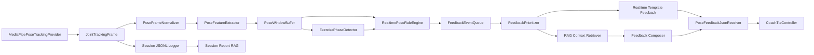
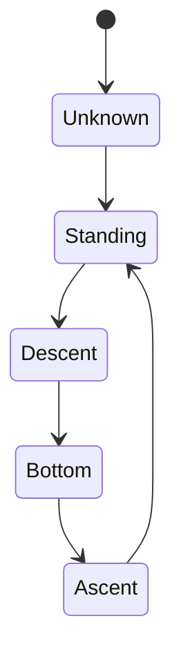

# RAG System Plan

작성일: 2026-07-01  
대상 프로젝트: Unity 기반 AI Healthcare Coach  
핵심 목표: MediaPipe 관절 JSON을 분석해 사용자가 운동 중일 때 실시간 자세 피드백을 제공하고, RAG를 통해 피드백의 근거와 설명 품질을 높인다.

## 1. 결론

실시간 피드백 구현은 가능하다. 다만 구조를 잘 나누어야 한다.

- MediaPipe 관절 추출과 1차 자세 판단은 Unity 로컬에서 처리해야 한다.
- RAG와 LLM 호출은 매 프레임마다 실행하면 안 된다.
- 실시간 피드백은 규칙 기반 분석 엔진이 즉시 생성하고, RAG는 운동 지식 검색, 피드백 문장 보강, 운동별 기준 로딩, 세션 종료 리포트 생성에 사용해야 한다.

권장 구조는 다음과 같다.

```text
MediaPipe
-> JointTrackingFrame JSON
-> Pose Feature Extractor
-> Rule-based Realtime Analyzer
-> Feedback Event Queue
-> RAG Context Retriever
-> Feedback Composer
-> UI / TTS / Session Report
```

즉, RAG 시스템은 실시간 루프의 중심이 아니라 실시간 루프를 보조하는 지식 계층이어야 한다. 이렇게 해야 15 FPS 이상 추적, 1초 이내 피드백, 자연스러운 설명을 모두 만족할 수 있다.

## 2. 현재 프로젝트 기준 연결 지점

현재 코드에는 이미 RAG 시스템을 붙이기 좋은 기반이 있다.

| 현재 요소 | 경로 | RAG 시스템에서의 역할 |
| --- | --- | --- |
| `JointTrackingFrame` | `Assets/Scripts/Pose/JointTrackingFrame.cs` | MediaPipe 관절 JSON의 표준 입력 모델 |
| `TrackedJoint` | `Assets/Scripts/Pose/JointTrackingFrame.cs` | 관절별 좌표, visibility, confidence 저장 |
| `PoseFeedbackAnalyzer` | `Assets/Scripts/Pose/Analysis/PoseFeedbackAnalyzer.cs` | 즉시 피드백을 생성하는 규칙 기반 분석기 |
| `PoseGeometry` | `Assets/Scripts/Pose/Analysis/PoseGeometry.cs` | 각도, 거리, 중심점 계산 유틸 |
| `PoseRuleConfig` | `Assets/Scripts/Pose/Analysis/PoseRuleConfig.cs` | 운동별 기준값을 외부 설정으로 분리할 위치 |
| `PoseFeedbackMessage` | `Assets/Scripts/Pose/PoseFeedbackMessage.cs` | UI/TTS로 전달할 피드백 이벤트 모델 |
| `PoseFeedbackJsonReceiver` | `Assets/Scripts/Pose/PoseFeedbackJsonReceiver.cs` | JSON 또는 객체 피드백을 받아 TTS로 전달 |
| `CoachTtsController` | `Assets/Scripts/Tts/CoachTtsController.cs` | 실시간 음성 코칭 출력 |

따라서 새 시스템은 기존 코드를 버리는 방식이 아니라, `PoseFeedbackAnalyzer` 앞뒤에 데이터 전처리, 운동 상태 추적, RAG 검색, 피드백 조합 계층을 추가하는 방식이 적합하다.

## 3. 실시간 피드백 가능 여부

가능하다. 조건은 다음과 같다.

1. 관절 추출은 로컬 MediaPipe로 실행한다.
   - 서버 왕복이 들어가면 지연 시간이 커져 실시간 피드백 품질이 떨어진다.
   - 현재 구조의 `LocalMediaPipe` 방향이 적합하다.

2. 자세 오류 탐지는 규칙 기반으로 즉시 처리한다.
   - 무릎 정렬, 상체 기울기, 좌우 균형, 골반 높이, 어깨 높이 같은 값은 각도와 거리 계산으로 바로 판단 가능하다.
   - 이 판단은 프레임 또는 0.3초에서 1초 사이의 짧은 윈도우에서 처리한다.

3. RAG/LLM은 비동기 보조 계층으로 둔다.
   - 매 프레임마다 RAG 검색이나 LLM 호출을 하면 실시간성이 깨진다.
   - 규칙 엔진이 `left_knee_alignment` 같은 이벤트를 만들면, 해당 `ruleId`로 관련 지식 chunk를 검색해서 설명 문장을 보강한다.
   - LLM 응답이 늦으면 로컬 템플릿 문장을 즉시 말하고, LLM 결과는 다음 반복 피드백이나 세션 요약에 반영한다.

권장 목표 성능은 다음과 같다.

| 항목 | 목표 |
| --- | --- |
| Pose 추적 | 15 FPS 이상 |
| 규칙 기반 분석 | 프레임당 1 ms에서 5 ms 이내 |
| 첫 피드백 지연 | 오류 발생 후 300 ms에서 1000 ms 이내 |
| 동일 피드백 반복 간격 | 2초에서 5초 cooldown |
| RAG 검색 | 로컬 인덱스 기준 50 ms 이내 |
| LLM 문장 보강 | 비동기, 실시간 필수 경로에서 제외 |

## 4. 핵심 설계 원칙

### 4.1 실시간 경로와 지식 경로 분리

실시간 경로는 빠르고 결정적이어야 한다.

```text
JointTrackingFrame
-> Feature Extraction
-> Rule Evaluation
-> FeedbackEvent
-> TTS/UI
```

지식 경로는 느려도 된다.

```text
FeedbackEvent
-> Retrieve Knowledge Chunks
-> Compose Better Coaching Text
-> Cache
-> Next Feedback / Report
```

### 4.2 LLM은 판단자가 아니라 설명자

자세가 틀렸는지 아닌지는 LLM이 아니라 알고리즘이 판단해야 한다.

이유:

- LLM은 매 프레임 숫자 판단에 비싸고 느리다.
- 같은 입력에도 출력이 달라질 수 있다.
- 운동 자세 피드백은 안전 문제가 있으므로 임계값과 판단 근거가 코드로 추적 가능해야 한다.

LLM은 다음 역할에만 사용한다.

- 사용자가 이해하기 쉬운 한국어 피드백 문장 생성
- 운동별 주의사항 설명
- 세션 종료 후 요약 리포트 생성
- 사용자의 질문에 대해 검색된 근거 기반 답변 생성

### 4.3 JSON은 원본 로그, 실시간 분석은 메모리 객체

MediaPipe 결과를 JSON으로 저장하는 것은 좋지만, 실시간 분석에서 매번 JSON 문자열을 파싱하면 불필요한 비용이 생긴다.

권장 방식:

- 실시간 루프: `JointTrackingFrame` 객체를 직접 전달
- 저장/재생/디버깅: JSONL 파일로 append
- RAG 오프라인 분석: 저장된 JSONL을 읽어서 세션 요약과 통계 생성

## 5. 전체 아키텍처



## 6. 개발 단계

### Phase 1: 실시간 분석 안정화

목표: RAG 없이도 즉시 피드백이 정확히 나오는 상태를 만든다.

구현 항목:

- `PoseFeatureExtractor` 추가
- `PoseWindowBuffer` 추가
- `ExercisePhaseDetector` 추가
- `RealtimePoseRuleEngine` 또는 기존 `PoseFeedbackAnalyzer` 확장
- `FeedbackPrioritizer` 추가
- TTS cooldown, 중복 억제, severity 우선순위 정리

완료 기준:

- 스쿼트 기준으로 무릎 정렬, 깊이, 상체 기울기, 좌우 균형 피드백이 1초 이내에 나온다.
- 같은 문장이 매 프레임 반복되지 않는다.
- visibility가 낮은 관절은 판단에서 제외된다.

### Phase 2: JSONL 세션 저장과 재생

목표: 실시간 추적 결과를 분석 가능한 세션 데이터로 만든다.

권장 저장 포맷:

```json
{"type":"frame","sessionId":"s_001","timestampUnixMilliseconds":1782748800000,"joints":[{"name":"left_knee","x":0.42,"y":0.68,"z":0.01,"visibility":0.94,"confidence":0.91}]}
{"type":"feedback","sessionId":"s_001","timestampUnixMilliseconds":1782748800450,"ruleId":"left_knee_alignment","severity":"Warning","text":"왼쪽 무릎이 발끝 방향에서 벗어났습니다."}
{"type":"phase","sessionId":"s_001","timestampUnixMilliseconds":1782748800800,"exercise":"squat","phase":"Bottom"}
```

JSON 배열 하나로 크게 저장하는 것보다 JSONL을 권장한다.

장점:

- 실시간 append가 쉽다.
- 앱이 중간에 종료되어도 이전 줄까지는 복구 가능하다.
- 세션 재생, 리포트 생성, 디버깅이 쉽다.

### Phase 3: 운동 지식 베이스 구축

목표: RAG가 검색할 수 있는 문서와 규칙 지식을 만든다.

초기 문서 위치 예시:

```text
Assets/StreamingAssets/RagKnowledge/
  exercises/
    squat.md
    lunge.md
    plank.md
  rules/
    squat_knee_alignment.md
    squat_torso_tilt.md
    squat_depth.md
  safety/
    pain_warning.md
    low_visibility.md
```

각 문서는 작은 chunk로 쪼갤 수 있게 구조화한다.

예시:

```markdown
---
id: squat_knee_alignment
exercise: squat
joint: knee
severity: warning
tags: [alignment, knee, foot]
---

무릎은 내려가는 동안 발끝 방향과 대체로 같은 방향을 유지해야 한다.
무릎이 안쪽으로 무너지면 무릎 관절에 부담이 증가할 수 있다.
초보자에게는 "무릎을 두 번째 발가락 방향으로 보낸다"는 표현이 이해하기 쉽다.
```

### Phase 4: 로컬 RAG 인덱스 구축

목표: 운동 지식 문서를 빠르게 검색한다.

MVP에서는 다음 둘 중 하나를 선택한다.

1. 규칙 ID 기반 검색
   - `ruleId -> KnowledgeChunk[]` 매핑
   - 가장 빠르고 구현이 쉽다.
   - 실시간 피드백에는 이 방식이 가장 안정적이다.

2. 하이브리드 검색
   - metadata filter + keyword score + embedding similarity
   - 사용자의 자유 질문과 세션 리포트에 좋다.
   - MVP 이후 확장에 적합하다.

실시간 피드백 MVP는 1번을 먼저 구현하고, 사용자의 질문 답변과 리포트에서 2번을 추가하는 순서가 좋다.

### Phase 5: 피드백 문장 조합

목표: 같은 오류라도 상황에 맞는 문장을 출력한다.

피드백 생성 우선순위:

1. 위험하거나 정확도가 높은 규칙 기반 템플릿을 즉시 출력
2. RAG 검색 결과가 이미 캐시되어 있으면 자연어 문장 보강
3. LLM 응답이 늦으면 다음 피드백 또는 세션 리포트에 반영

예시:

```text
Rule event:
  ruleId = left_knee_alignment
  exercise = squat
  severity = Warning
  joint = left_knee
  confidence = 0.88

Immediate template:
  왼쪽 무릎이 안쪽으로 무너지고 있습니다. 발끝 방향으로 맞춰 주세요.

RAG-enhanced:
  왼쪽 무릎을 두 번째 발가락 방향으로 보내세요. 내려가는 동안 무릎과 발끝이 같은 방향을 보게 유지하면 더 안정적입니다.
```

### Phase 6: 세션 리포트 RAG

목표: 운동이 끝난 뒤 JSON 로그를 바탕으로 요약 리포트를 만든다.

리포트에 포함할 내용:

- 총 운동 시간
- 반복 횟수 추정
- 가장 자주 나온 피드백 TOP 3
- 좌우 불균형 요약
- 개선된 구간과 악화된 구간
- 다음 세션에서 집중할 1개 목표

세션 리포트는 실시간보다 시간이 덜 중요하므로 RAG와 LLM을 적극적으로 써도 된다.

## 7. 알고리즘 설계

### 7.1 관절 전처리

입력:

```text
JointTrackingFrame.joints[]
```

처리:

1. joint name으로 빠르게 조회할 수 있도록 dictionary로 변환
2. visibility/confidence가 낮은 관절 제외
3. 좌표 mirror 여부 보정
4. optional smoothing 적용
5. 프레임 timestamp 보정

권장 필터:

- 단순 MVP: EMA 필터
- 이후 개선: One Euro Filter

EMA 예시:

```text
smoothed = alpha * current + (1 - alpha) * previous
```

권장 `alpha`:

- 빠른 반응 우선: 0.6에서 0.8
- 안정적인 시각화 우선: 0.3에서 0.5

주의:

- TTS 피드백 판단에는 너무 강한 smoothing을 걸면 반응이 늦어진다.
- 화면 skeleton 렌더링은 더 강한 smoothing을 적용해도 된다.

### 7.2 Feature Extraction

프레임마다 다음 feature를 계산한다.

| Feature | 계산 방식 | 사용 목적 |
| --- | --- | --- |
| `leftKneeAngle` | angle(left_hip, left_knee, left_ankle) | 스쿼트 깊이, 좌우 균형 |
| `rightKneeAngle` | angle(right_hip, right_knee, right_ankle) | 스쿼트 깊이, 좌우 균형 |
| `torsoTilt` | shoulder midpoint와 hip midpoint 벡터 | 상체 숙임 판단 |
| `hipLevelDelta` | abs(left_hip.y - right_hip.y) | 골반 좌우 기울기 |
| `shoulderLevelDelta` | abs(left_shoulder.y - right_shoulder.y) | 어깨 좌우 기울기 |
| `centerBalanceOffset` | hip center x와 ankle center x 차이 | 중심 이동 판단 |
| `kneeValgusOffset` | knee와 hip-ankle line 거리 | 무릎 안쪽/바깥쪽 이탈 판단 |
| `jointVelocity` | 현재 좌표와 이전 좌표 차이 / dt | 동작 속도, phase 판단 |

### 7.3 짧은 시간 윈도우 분석

단일 프레임만 보면 MediaPipe 노이즈 때문에 잘못된 피드백이 나올 수 있다.

따라서 최근 0.5초에서 2초 정도의 window를 유지한다.

예시:

```text
15 FPS 기준
0.5초 window = 8 frames
1.0초 window = 15 frames
2.0초 window = 30 frames
```

윈도우에서 계산할 통계:

- 평균 각도
- 최소/최대 각도
- 중앙값
- 표준편차
- 오류 발생 frame 비율
- visibility 평균

피드백 발생 조건 예시:

```text
if kneeValgusOffset > threshold for at least 60% of recent valid frames:
    emit knee alignment warning
```

이 방식은 단일 프레임 튐 때문에 음성 피드백이 잘못 나오는 문제를 줄인다.

### 7.4 운동 phase 감지

스쿼트 예시 상태 머신:



상태 판단 예시:

| Phase | 조건 |
| --- | --- |
| `Standing` | kneeAngle이 크고 hip이 높음 |
| `Descent` | kneeAngle이 감소하고 hip이 내려감 |
| `Bottom` | kneeAngle이 최소 근처이고 속도가 작음 |
| `Ascent` | kneeAngle이 증가하고 hip이 올라감 |

phase를 쓰면 피드백 품질이 좋아진다.

예:

- 내려가는 중에는 "천천히 내려가세요"
- 바닥 지점에서는 "무릎 방향을 발끝과 맞추세요"
- 올라오는 중에는 "중심이 한쪽으로 쏠립니다"

### 7.5 규칙 기반 피드백 알고리즘

규칙은 다음 형태로 관리한다.

```text
Rule
  id
  exercise
  requiredJoints
  phaseFilter
  threshold
  severity
  cooldownSeconds
  evaluate(features, window, phase) -> FeedbackEvent?
```

예시 규칙:

```text
id: squat_knee_alignment
requiredJoints: hip, knee, ankle, foot_index
phaseFilter: Descent, Bottom, Ascent
condition:
  kneeValgusOffset > maximumKneeValgusOffset
  and validFrameRatio >= 0.6
feedback:
  severity: Warning
  text: 무릎이 발끝 방향에서 벗어났습니다.
```

### 7.6 피드백 우선순위

한 프레임에서 여러 오류가 동시에 발생할 수 있다. TTS는 한 번에 하나만 말해야 하므로 우선순위가 필요하다.

권장 점수:

```text
priorityScore =
  severityWeight
  + confidence * 2
  + persistenceRatio * 2
  + safetyWeight
  - recentlySpokenPenalty
```

Severity weight:

```text
Critical = 100
Warning = 50
Info = 10
```

피드백 선택 규칙:

- 통증, 위험, 넘어짐 가능성은 최우선
- 같은 `ruleId`는 cooldown 동안 말하지 않음
- 같은 joint에 대한 피드백이 여러 개면 severity가 높은 것만 출력
- 2초 안에 TTS가 너무 많이 나오면 가장 중요한 1개만 유지

## 8. 자료구조 설계

### 8.1 기존 입력 모델

```csharp
public sealed class JointTrackingFrame
{
    public string id;
    public string sessionId;
    public long timestampUnixMilliseconds;
    public TrackedJoint[] joints;
    public PoseFeedbackMessage[] feedback;
}
```

이 모델은 유지한다. RAG 시스템의 입력도 이 구조를 기준으로 한다.

### 8.2 빠른 관절 조회용 구조

```csharp
public sealed class PoseFrameView
{
    public JointTrackingFrame RawFrame;
    public long TimestampUnixMilliseconds;
    public Dictionary<string, TrackedJoint> JointsByName;
}
```

목적:

- `TryGetJoint` 반복 탐색 비용 감소
- feature 계산 코드 단순화
- visibility 기준 필터링을 한 곳에서 처리

MediaPipe 33개 관절만 쓰면 성능 문제는 작지만, 코드 명확성과 확장성을 위해 필요하다.

### 8.3 Feature frame

```csharp
public sealed class PoseFeatureFrame
{
    public long TimestampUnixMilliseconds;
    public string Exercise;
    public float LeftKneeAngle;
    public float RightKneeAngle;
    public float TorsoTiltDegrees;
    public float HipLevelDelta;
    public float ShoulderLevelDelta;
    public float CenterBalanceOffset;
    public float LeftKneeValgusOffset;
    public float RightKneeValgusOffset;
    public float ValidityScore;
}
```

목적:

- 원본 관절 좌표와 분석 feature를 분리
- 규칙 엔진이 좌표가 아니라 의미 있는 값만 보게 함
- 세션 리포트에서 통계 계산을 쉽게 함

### 8.4 Ring buffer

```csharp
public sealed class PoseWindowBuffer
{
    private readonly PoseFeatureFrame[] frames;
    private int nextIndex;
    private int count;

    public void Add(PoseFeatureFrame frame);
    public IEnumerable<PoseFeatureFrame> RecentFrames();
    public PoseWindowStats CalculateStats();
}
```

목적:

- 최근 N프레임만 유지
- 오래된 프레임 자동 제거
- allocation 없이 안정적으로 실시간 동작

Unity 실시간 루프에서는 `Queue<T>`보다 고정 배열 ring buffer가 더 적합하다.

### 8.5 Window stats

```csharp
public sealed class PoseWindowStats
{
    public int ValidFrameCount;
    public float ValidFrameRatio;
    public float AverageLeftKneeAngle;
    public float AverageRightKneeAngle;
    public float MinKneeAngle;
    public float AverageTorsoTiltDegrees;
    public float KneeAlignmentViolationRatio;
    public float CenterBalanceViolationRatio;
}
```

목적:

- "최근 1초 동안 계속 틀렸는지" 판단
- 일시적인 노이즈 제거
- 반복 횟수와 자세 안정성 계산

### 8.6 운동 phase 상태

```csharp
public enum ExercisePhase
{
    Unknown,
    Standing,
    Descent,
    Bottom,
    Ascent
}

public sealed class ExercisePhaseState
{
    public string Exercise;
    public ExercisePhase CurrentPhase;
    public ExercisePhase PreviousPhase;
    public int RepCount;
    public long PhaseStartedAt;
}
```

목적:

- 운동 반복 횟수 계산
- phase별 피드백 구분
- 세션 리포트 품질 향상

### 8.7 Feedback event

```csharp
public sealed class FeedbackEvent
{
    public string Id;
    public string RuleId;
    public string Exercise;
    public string Joint;
    public FeedbackSeverity Severity;
    public float Confidence;
    public float PersistenceRatio;
    public long TimestampUnixMilliseconds;
    public string TemplateText;
    public Dictionary<string, float> Evidence;
}
```

목적:

- 규칙 판단 결과와 출력 문장을 분리
- RAG 검색 키로 `RuleId`, `Exercise`, `Joint` 사용
- 나중에 "왜 이 피드백이 나왔는지" 설명 가능

### 8.8 Knowledge chunk

```csharp
public sealed class KnowledgeChunk
{
    public string Id;
    public string SourcePath;
    public string Exercise;
    public string RuleId;
    public string Joint;
    public string[] Tags;
    public string Text;
    public float[] Embedding;
}
```

목적:

- RAG 검색 단위
- rule 기반 검색과 embedding 검색을 모두 지원
- 출처 추적 가능

### 8.9 Retrieval result

```csharp
public sealed class RetrievalResult
{
    public KnowledgeChunk Chunk;
    public float Score;
    public string MatchReason;
}
```

목적:

- 검색 결과 점수화
- 어떤 이유로 검색되었는지 디버깅 가능

## 9. RAG 검색 설계

### 9.1 실시간 피드백 검색

실시간 피드백에서는 query를 자연어로 만들 필요가 없다. 이미 `ruleId`, `exercise`, `joint`, `severity`가 있으므로 metadata 검색이 가장 빠르고 안정적이다.

검색 순서:

1. `ruleId` 정확 매칭
2. `exercise + joint` 매칭
3. `exercise + tags` 매칭
4. fallback 문서 검색

예시:

```text
event.ruleId = squat_knee_alignment
event.exercise = squat
event.joint = left_knee

retrieve:
  rules/squat_knee_alignment.md
  exercises/squat.md#knee
  safety/knee_alignment.md
```

### 9.2 사용자 질문 검색

사용자가 "왜 무릎을 발끝 방향으로 맞춰야 해?" 같은 질문을 하면 hybrid retrieval이 좋다.

검색 score:

```text
score =
  embeddingSimilarity * 0.55
  + keywordScore * 0.25
  + metadataScore * 0.20
```

metadataScore 예시:

- 현재 운동이 squat이면 squat 문서 가산점
- 최근 나온 ruleId와 같은 문서 가산점
- 최근 문제 joint와 같은 문서 가산점

### 9.3 세션 리포트 검색

세션 리포트는 JSONL 로그를 요약한 구조화 데이터와 운동 지식 chunk를 함께 사용한다.

입력:

```json
{
  "exercise": "squat",
  "durationSeconds": 420,
  "repCount": 35,
  "topFeedback": [
    {"ruleId": "squat_knee_alignment", "count": 18},
    {"ruleId": "squat_torso_tilt", "count": 7}
  ],
  "leftRightImbalance": 0.22
}
```

RAG 검색:

- `squat_knee_alignment`
- `squat_torso_tilt`
- `squat beginner correction`
- `left right imbalance`

출력:

- 사용자용 요약
- 다음 운동 목표
- 주의할 점
- 개선 우선순위

## 10. 피드백 생성 정책

### 10.1 실시간 문장 길이

실시간 TTS 문장은 짧아야 한다.

권장:

- 1문장
- 2초 이내로 말할 수 있는 길이
- 한 번에 하나의 행동만 지시

좋은 예:

```text
무릎을 발끝 방향으로 맞춰 주세요.
상체를 조금 더 세워 주세요.
왼쪽으로 중심이 쏠립니다. 양발 중앙으로 돌아오세요.
```

나쁜 예:

```text
현재 무릎이 안쪽으로 들어오고 있고 이 상태는 무릎 관절에 부담을 줄 수 있으니 고관절 외회전을 사용해서 발끝과 무릎의 정렬을 맞추는 것이 좋습니다.
```

긴 설명은 실시간 TTS가 아니라 세션 리포트나 사용자의 질문 답변에서 제공한다.

### 10.2 안전 정책

운동 피드백에는 안전 문구가 필요하다.

규칙:

- 통증을 호소하면 즉시 운동 중단 안내
- visibility가 낮으면 자세 판단을 확정하지 않음
- confidence가 낮으면 강한 교정 표현을 피함
- 의학적 진단처럼 말하지 않음
- "통증이 있으면 중단하고 전문가에게 상담하세요" 같은 안전 fallback을 둠

### 10.3 피드백 강도

Severity별 문장 톤:

| Severity | 톤 | 예시 |
| --- | --- | --- |
| `Info` | 부드러운 안내 | 조금 더 천천히 내려가세요. |
| `Warning` | 명확한 교정 | 무릎이 안쪽으로 무너집니다. 발끝 방향으로 맞춰 주세요. |
| `Critical` | 즉시 중단 또는 주의 | 통증이 있으면 동작을 멈추고 휴식하세요. |

## 11. 구현 클래스 제안

권장 폴더:

```text
Assets/Scripts/Rag/
  Runtime/
    PoseFrameNormalizer.cs
    PoseFeatureExtractor.cs
    PoseWindowBuffer.cs
    ExercisePhaseDetector.cs
    RealtimePoseRuleEngine.cs
    FeedbackEvent.cs
    FeedbackPrioritizer.cs
    RealtimeFeedbackOrchestrator.cs
  Knowledge/
    KnowledgeChunk.cs
    RagKnowledgeLoader.cs
    RagIndex.cs
    RagRetriever.cs
  Composition/
    FeedbackComposer.cs
    FeedbackTemplateStore.cs
  Logging/
    SessionJsonlLogger.cs
    SessionSummaryBuilder.cs
```

기존 `Assets/Scripts/Pose/Analysis`에 모두 넣어도 되지만, RAG와 세션 리포트까지 커질 가능성이 있으므로 `Assets/Scripts/Rag`를 분리하는 편이 좋다.

### 11.1 RealtimeFeedbackOrchestrator

역할:

- `JointTrackingController.TrackingFrameReceived` 구독
- frame normalization
- feature extraction
- window buffer update
- phase update
- rule evaluation
- feedback prioritization
- RAG 검색 요청
- 즉시 피드백 출력

흐름:

```text
OnTrackingFrame(frame):
  view = normalizer.Normalize(frame)
  feature = extractor.Extract(view)
  buffer.Add(feature)
  phase = phaseDetector.Update(buffer)
  events = ruleEngine.Evaluate(feature, buffer, phase)
  selected = prioritizer.Select(events)
  feedback = composer.ComposeImmediate(selected)
  receiver.ReceiveFeedback(feedback)
  ragRetriever.WarmupAsync(selected)
```

### 11.2 RagRetriever

역할:

- knowledge chunk 로드
- ruleId 기반 빠른 검색
- optional embedding 검색
- 검색 결과 캐시

캐시 key:

```text
exercise|ruleId|joint
```

예:

```text
squat|squat_knee_alignment|left_knee
```

### 11.3 FeedbackComposer

역할:

- 즉시 출력 문장 생성
- RAG 검색 결과가 있으면 더 좋은 문장 선택
- TTS 길이 제한
- 한국어 문장 템플릿 관리

MVP에서는 LLM 없이 template + RAG 문구만으로도 충분하다.

LLM은 다음 단계에서 추가한다.

## 12. LLM 사용 위치

LLM을 반드시 써야 하는 부분과 쓰면 안 되는 부분을 구분한다.

### 쓰면 좋은 곳

- 사용자의 자세 질문 답변
- 세션 종료 리포트
- 피드백 문장 다양화
- 운동별 코칭 설명 생성
- 난이도별 운동 계획 추천

### 쓰면 안 되는 곳

- 매 프레임 자세 오류 판단
- 통증/위험 여부 최종 판단
- 관절 좌표 직접 해석
- 15 FPS 실시간 루프 내부 동기 호출

## 13. MVP 구현 순서

가장 현실적인 구현 순서는 다음과 같다.

1. `SessionJsonlLogger` 구현
   - 모든 `JointTrackingFrame`과 피드백 이벤트 저장

2. `PoseFeatureExtractor` 구현
   - 기존 `PoseGeometry`를 재사용해 각도와 offset 계산

3. `PoseWindowBuffer` 구현
   - 최근 1초에서 2초 feature 유지

4. `ExercisePhaseDetector` 구현
   - 스쿼트 phase와 rep count부터 구현

5. `RealtimePoseRuleEngine` 구현
   - 기존 `PoseFeedbackAnalyzer` 규칙을 window 기반으로 이동 또는 확장

6. `FeedbackPrioritizer` 구현
   - severity, confidence, cooldown 기반으로 1개 피드백 선택

7. `RagKnowledgeLoader` 구현
   - `StreamingAssets/RagKnowledge` markdown/json 로드

8. `RagRetriever` 구현
   - ruleId metadata 검색 MVP

9. `FeedbackComposer` 구현
   - template + retrieved coaching text 조합

10. `SessionSummaryBuilder` 구현
   - JSONL 기반 세션 종료 리포트 생성

## 14. 실시간 피드백 구현 상세

### 14.1 동기 경로

동기 경로는 절대 가볍게 유지한다.

```text
Frame received
-> calculate features
-> evaluate rules
-> select one feedback
-> speak
```

여기에는 파일 IO, 네트워크, LLM 호출을 넣지 않는다.

### 14.2 비동기 경로

비동기 경로는 다음 작업을 담당한다.

- JSONL append
- RAG 검색 캐시 갱신
- LLM 문장 생성
- 세션 통계 업데이트

비동기 결과가 늦게 도착해도 실시간 피드백은 이미 나가야 한다.

### 14.3 fallback

RAG 검색 실패 또는 LLM 실패 시:

- 로컬 템플릿 문장 사용
- 규칙 기반 피드백은 계속 동작
- 세션 로그에 실패 사유 기록

## 15. 장점 3가지

### 장점 1: 실시간성이 좋다

자세 판단을 로컬 규칙 엔진에서 처리하므로 RAG/LLM 지연 시간에 영향을 덜 받는다. 사용자는 운동 중 바로 피드백을 받을 수 있다.

### 장점 2: 피드백 근거 추적이 가능하다

각 피드백이 `ruleId`, feature 값, threshold, knowledge chunk와 연결된다. 나중에 왜 이 피드백이 나왔는지 디버깅하거나 리포트로 설명하기 쉽다.

### 장점 3: 확장성이 좋다

스쿼트에서 시작해 런지, 플랭크, 푸시업으로 확장할 때 운동별 rule config와 knowledge 문서를 추가하면 된다. LLM 프롬프트만 늘리는 방식보다 유지보수가 쉽다.

## 16. 단점 3가지

### 단점 1: 초기 설계와 구현량이 많다

단순히 JSON을 LLM에 보내는 방식보다 feature extractor, window buffer, rule engine, retriever, composer를 나누어 만들어야 한다.

### 단점 2: 규칙 기준값 튜닝이 필요하다

사람마다 체형, 카메라 각도, 운동 범위가 다르므로 threshold를 한 번에 정확히 맞추기 어렵다. 테스트 영상과 실제 사용자 데이터를 바탕으로 계속 조정해야 한다.

### 단점 3: RAG가 실시간 판단 자체를 대체하지 못한다

RAG는 지식 검색과 설명에는 강하지만 관절 좌표를 실시간으로 안정적으로 판정하는 엔진은 아니다. 따라서 규칙 기반 분석과 RAG를 함께 운영해야 한다.

## 17. 리스크와 대응

| 리스크 | 영향 | 대응 |
| --- | --- | --- |
| 카메라 각도 차이 | 같은 자세도 좌표가 다르게 나옴 | 초기 calibration, normalized feature, 사용자 위치 안내 |
| visibility 낮음 | 잘못된 피드백 발생 | minimum visibility 미달 시 판단 보류 |
| MediaPipe 좌표 노이즈 | TTS가 흔들림 | EMA/One Euro filter, window ratio 조건 |
| LLM 지연 | 실시간성 저하 | LLM은 비동기, 로컬 템플릿 fallback |
| 피드백 과다 | 사용자 경험 저하 | severity 우선순위, cooldown, 한 번에 하나만 출력 |
| 운동 종류 증가 | 규칙 복잡도 증가 | exercise별 rule config와 knowledge 문서 분리 |

## 18. 테스트 계획

### 18.1 단위 테스트

대상:

- `PoseGeometry.Angle`
- `PoseFeatureExtractor`
- `PoseWindowBuffer`
- `ExercisePhaseDetector`
- `RealtimePoseRuleEngine`
- `RagRetriever`

검증:

- 관절 3개로 각도가 올바르게 계산되는지
- visibility 낮은 관절이 제외되는지
- window 통계가 정확한지
- ruleId 기반 검색이 올바른 chunk를 찾는지

### 18.2 재생 테스트

저장된 JSONL을 다시 읽어 실시간처럼 재생한다.

목적:

- 같은 입력에서 같은 피드백이 나오는지 확인
- threshold 조정 반복
- 실제 카메라 없이 분석기 테스트

### 18.3 현장 테스트

테스트 케이스:

- 정면 스쿼트
- 측면 스쿼트
- 무릎 안쪽 무너짐
- 상체 과도한 숙임
- 좌우 중심 쏠림
- 발이 화면 밖으로 나간 상태
- 조명이 어두운 상태
- 부분 가림

성공 기준:

- 올바른 자세에서는 피드백이 과하게 나오지 않는다.
- 명확한 오류에서는 1초 이내에 피드백이 나온다.
- 같은 문장이 반복적으로 쏟아지지 않는다.

## 19. 추천 MVP 범위

처음부터 완전한 RAG 코치를 만들기보다 다음 범위로 시작하는 것이 좋다.

운동:

- 스쿼트 1개

실시간 피드백:

- 무릎 정렬
- 스쿼트 깊이
- 상체 기울기
- 좌우 무릎 각도 차이
- 중심 쏠림

RAG:

- ruleId 기반 knowledge 검색
- 피드백 문장 보강
- 세션 종료 요약

나중에 추가:

- embedding 검색
- 사용자 질문 답변
- 운동 루틴 추천
- 개인별 threshold 자동 보정
- 다중 운동 인식

## 20. 최종 요약

이 프로젝트에서 실시간 피드백은 충분히 구현 가능하다. 이미 MediaPipe 관절 데이터를 `JointTrackingFrame`으로 받을 수 있고, `PoseFeedbackAnalyzer`, `PoseGeometry`, `PoseFeedbackJsonReceiver`, `CoachTtsController`가 있기 때문에 관절 분석부터 음성 출력까지의 기본 파이프라인은 잡혀 있다.

중요한 설계 방향은 RAG를 실시간 판단 엔진으로 쓰지 않는 것이다. 실시간 판단은 각도, 거리, 속도, 최근 window 통계, 운동 phase를 사용하는 규칙 기반 알고리즘으로 처리해야 한다. RAG는 그 판단의 근거 문서와 설명 문장을 찾아 피드백 품질을 높이는 역할을 맡아야 한다.

권장 구현 방향은 다음과 같다.

1. MediaPipe가 만든 `JointTrackingFrame`을 실시간으로 받는다.
2. 관절 좌표를 전처리하고 visibility가 낮은 값은 제외한다.
3. 무릎 각도, 상체 기울기, 좌우 균형, 중심 offset 같은 feature를 계산한다.
4. 최근 1초 정도의 ring buffer를 유지해 노이즈를 줄인다.
5. 운동 phase를 감지해 내려가는 중, 바닥 지점, 올라오는 중에 맞는 규칙을 적용한다.
6. 규칙 엔진이 `FeedbackEvent`를 만들고 우선순위와 cooldown으로 출력할 피드백을 고른다.
7. 즉시 출력은 로컬 템플릿으로 처리한다.
8. RAG는 `ruleId`, `exercise`, `joint`로 관련 운동 지식을 검색해 문장을 보강하고 세션 리포트에 사용한다.
9. 모든 frame과 feedback은 JSONL로 저장해 재생 테스트와 리포트 생성에 활용한다.

이 구조의 핵심 장점은 실시간성, 근거 추적성, 확장성이다. 단점은 초기 구현량이 많고 threshold 튜닝이 필요하며 RAG가 실시간 판단을 직접 대체할 수 없다는 점이다. 그래도 제품 관점에서는 이 방향이 가장 안전하고 현실적이다. 사용자가 운동 중에는 빠른 규칙 기반 피드백을 받고, 운동 후에는 RAG 기반으로 자세한 설명과 개선 방향을 받는 구조가 가장 적합하다.
